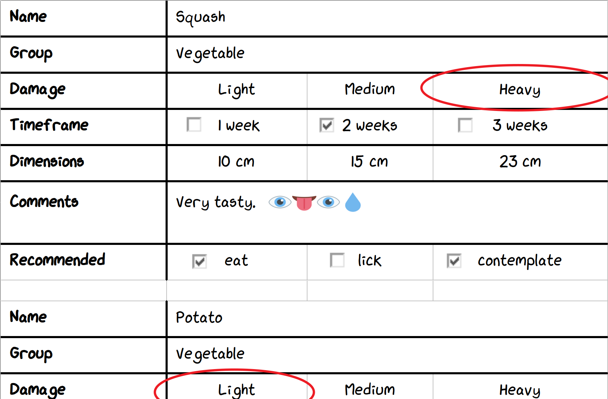
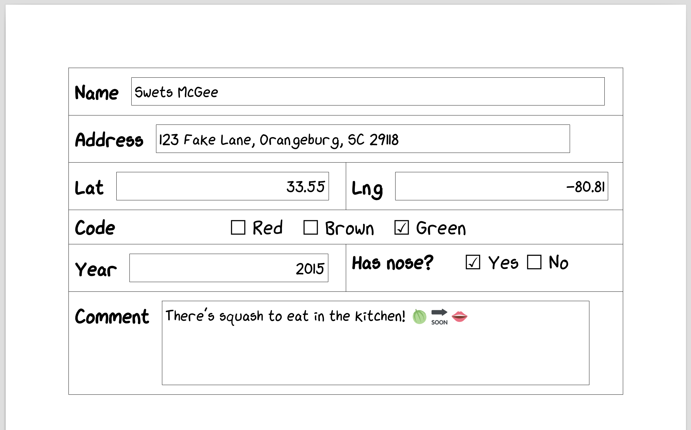
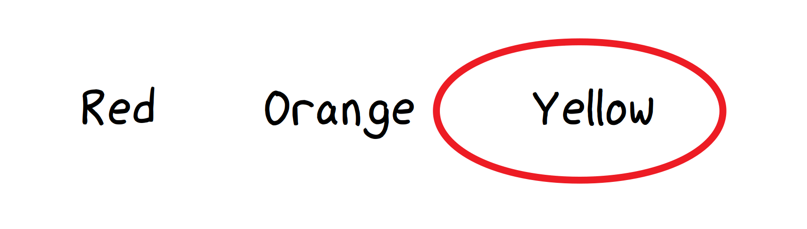
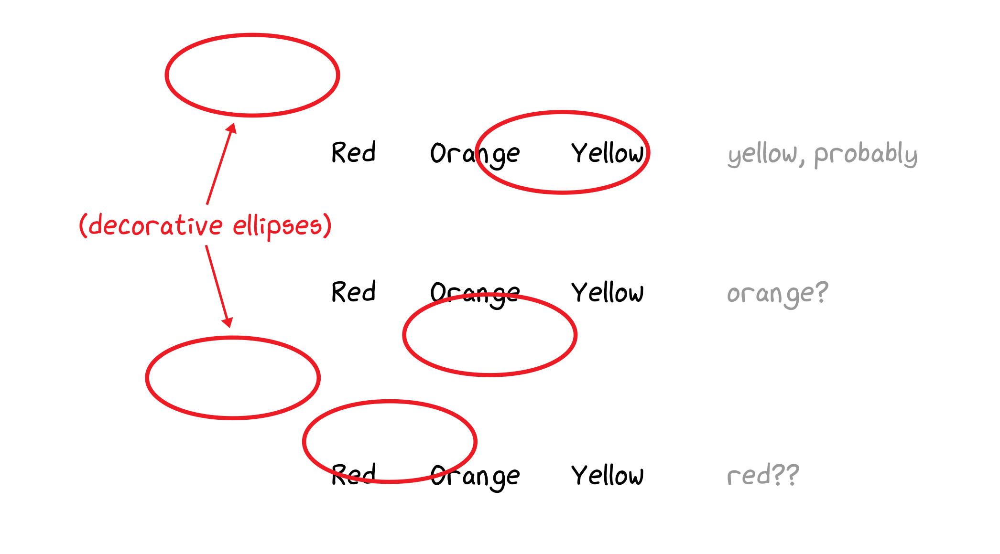
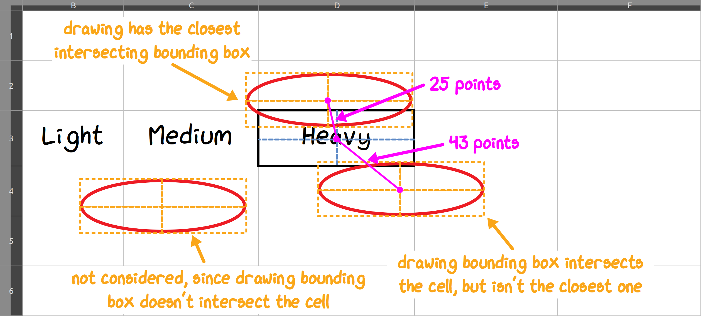
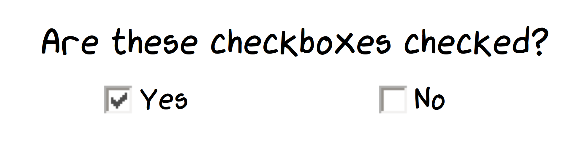
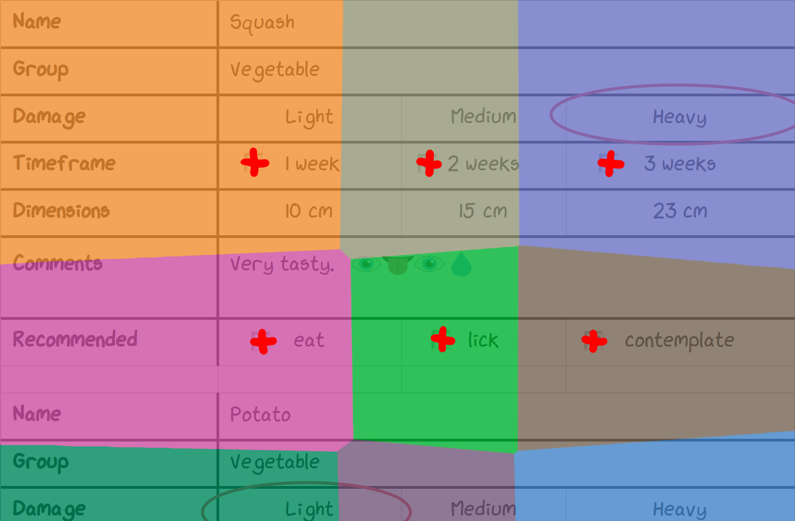
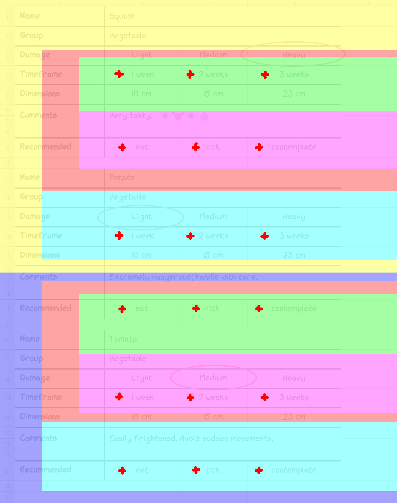
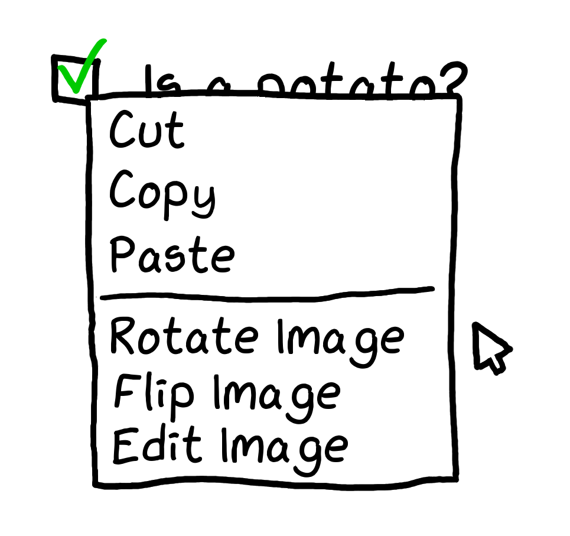
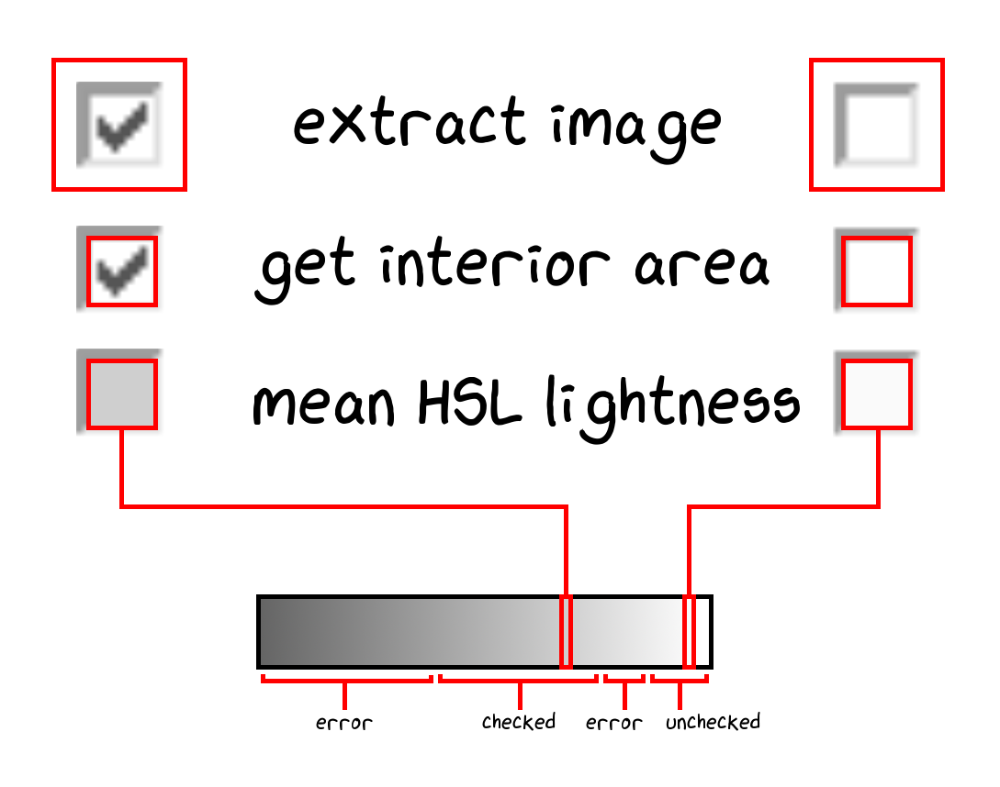

_**Author's note:**_

_What has Anthony been up to lately, besides building a massive tolerance to Lazeez hot sauce?_

_One year ago, I was wondering whether any full-time jobs could offer enough freedom to do everything I want to. There were none, so two friends and I started our own company instead. Turns out it's a lot of work!_

_We traded one boss for two dozen, but it was [so](https://www.instagram.com/p/BuflEyyBIuj/) [worth](https://www.instagram.com/p/Brl7V4QBSkN/) [it](https://www.instagram.com/p/Brboo_YheZQ/)._

Cross posted from [Medium](https://medium.com/@hypotenuselabs/attack-on-checkbox-when-data-ingestion-gets-ugly-999fcdc5e000). We'll be back to our regularly scheduled programming soon!

_**Disclaimer:** All material in this post has been used with permission. Certain details modified for client confidentiality._

The Project That Started It All
-------------------------------

We founded our [software consultancy](https://hypotenuse.ca/) so we could pursue our dreams in a way that full-time jobs wouldn't let us: as a touring death metal drummer, a mad roboticist, and a one-man band.

It was just three of us in Calvin's living room when our first client called.

> "We need a feature for our webapp where users can upload Excel and Word files, then it ingests all the form data to a database."

Sounds easy.

Read in some files, parse the relevant pieces, and store them to a database.

How hard could that be?

### The Files

The forms seemed organised and clear&mdash;like this:

_One small segment of an **XLSX** or **XLS** form._

And this:

_One small segment of a **DOC** form._

We were dealing with **DOC** (Word binary file format), **XLSX** (Office Open XML Format), and **XLS** (Excel binary file format) files.

Circled Items
-------------

We started with XLSX files. Thankfully, there's a Python library for parsing XLSX files: [OpenPyXL](https://openpyxl.readthedocs.io/){:target="_blank" rel="noopener noreferrer"}. Soon, we were extracting data like nobody's business!

However, it was not to last:

_Users drawing circles over selected options..._

**Problem:** Uh-oh. To pick an option, users were **drawing ellipses over them**. And sometimes they would be drawn **in between options**.

Also, parts of the spreadsheet were resized, sometimes causing the ellipses to lose alignment with their options:

_...but not always very neatly._

Also, OpenPyXL (as of this writing) doesn't support reading drawings from files.

**Solution:** To start, we researched our options for accessing drawings.

1. **Use a different XLSX parsing library.** The [Python-Excel website](http://www.python-excel.org/){:target="_blank" rel="noopener noreferrer"} lists several, but none of them support drawings/images/form controls. The [oleobj](https://github.com/decalage2/oletools/wiki/oleobj){:target="_blank" rel="noopener noreferrer"} utility from [python-oletools](https://github.com/decalage2/oletools){:target="_blank" rel="noopener noreferrer"} is a promising option, but doesn’t expose certain bounding-box fields we need.
2. **Control an Excel instance using the [COM API](https://docs.microsoft.com/en-us/visualstudio/vsto/excel-object-model-overview?view=vs-2017){:target="_blank" rel="noopener noreferrer"}.** Our script must run online and within a Dockerized infrastructure. A dedicated Windows server with Excel would incur a significant maintenance burden. Additionally, neither LibreOffice nor Gnumeric have equivalent APIs for this.
3. **Extend OpenPyXL to support drawings.** We’d need to understand the library more, and how the XLSX file format works&mdash;that could be time-consuming.

We decided to go with Option 3. Essentially, XLSX files consist of a collection of XML files inside a ZIP file. Retrieving the drawing data would boil down to parsing XML.

Within an XLSX file, each **worksheet XML file** references a **relationships XML file**, that associates drawing IDs to their corresponding **drawing XML files**.

From these, we could determine the location of each drawing, described within each drawing's metadata by a reference cell and an offset from that cell.

The reference cell's row (in **points**) and column (in **characters**), plus an X/Y axis offset (in **points**), is the top left corner of the drawing's bounding box:

_An unusual coordinate system for an unusual problem._

To translate this into a more convenient coordinate system, we converted all units into points, determined the reference cell's position, and added the cell offset.

One problem here was converting column widths defined in terms of **characters**&mdash;a poorly-defined and font-dependent unit&mdash;into **points**.

Microsoft gives a [conversion factor of 8.43](https://support.office.com/en-us/article/change-the-column-width-and-row-height-72f5e3cc-994d-43e8-ae58-9774a0905f46){:target="_blank" rel="noopener noreferrer"}, but this was far from accurate when we actually tried it.

Instead, we estimated the actual value to three significant digits via empirical measurement in a test spreadsheet, using the default font settings.

The result: $$\mathrm{cell\_width\_in\_points} = \mathrm{cell\_width\_in\_characters} \times \frac{72.23}{13}$$.


POINTS_PER_CHARACTER = 72.23 / 13

def row_col_offset_to_xy_points(row, col, offset_x, offset_y, col_widths, row_heights):
    pos_x = sum(col_widths[i] for i in range(col)) * POINTS_PER_CHARACTER + offset_x
    pos_y = sum(row_heights[j] for j in range(row)) + offset_y
    return (pos_x, pos_y)


_Note: This conversion factor changes with the spreadsheet’s default column-width setting. However, none of the files would change this setting, so we didn't need to account for it._

Now we have simple coordinates for every cell and drawing! We've located cells containing words, and the ellipses that circle some of those words.

Next, we had to determine which of those words are circled. For each ellipse, we looked at the cells overlapped by its bounding box, then found the closest one by midpoint distance.

To catch ambiguously circled options, we filtered out cells farther than a small distance limit $$\epsilon$$.

_Selecting drawings by distance. The cell intersection test accounts for closely-spaced form rows._

It wasn't pretty, but it worked well! A few files needed manual tweaks as they had ambiguities unreadable even to humans.

OLE Checkboxes
--------------

But wait, there’s more! [OLE checkboxes](https://docs.microsoft.com/en-us/dotnet/api/microsoft.office.tools.excel.controls.checkbox?view=vsto-2017){:target="_blank" rel="noopener noreferrer"}:

_Sample OLE checkboxes. Not to scale._

OLE is a Microsoft technology for embedding things, such as Word docs inside Excel sheets, or formulas inside Word docs. In our case, OLE was used to embed checkbox controls inside spreadsheets. 

However, OpenPyXL doesn't expose these checkboxes.

Adding OLE form control parsing was pretty simple - it was similar to how we added drawings parsing to OpenPyXL.

Since OLE form controls used the same unusual coordinate system as drawings, we could also reuse the `row_col_offset_to_xy_points` function from the ellipse-handling code.

To determine where checkbox data is stored within an XLSX file, we created two test spreadsheets: One with a selected checkbox and one with an unselected checkbox. We extracted the XLSX files as ZIP archives, then compared the resulting directory trees.

We saw that each OLE object has a **control properties XML file** containing its data, referenced by a **relationships XML file**, which in turn is referenced by each **worksheet XML file**!

Now we had the location of every checkbox. Looking at the forms, these were clearly placed by hand&mdash;some checkboxes were completely outside of their intended cell!

Much like circled items, we associated each form field's cell with the closest checkbox by midpoint distance.

**Problem:** This worked, but each form would take ~60 seconds to process; they were huge hand-filled datasets.

Uh-oh. To keep the app responsive this needed to run within a few seconds! Our first suspect was checkbox matching, which takes $$O(n^2)$$ time with respect to the number of checkboxes.

**Solution:** Our first idea was to use [nearest neighbour search](https://en.wikipedia.org/wiki/Nearest_neighbor_search){:target="_blank" rel="noopener noreferrer"} with a [discrete Voronoi decomposition](https://en.wikipedia.org/wiki/Voronoi_diagram){:target="_blank" rel="noopener noreferrer"}, computable in [$$O(n \log n)$$ time](https://en.wikipedia.org/wiki/Fortune%27s_algorithm){:target="_blank" rel="noopener noreferrer"}.

_Voronoi diagram; points are checkboxes within the form._

Since the forms were narrow and tall, we instead used a much simpler approach to computing nearest-neighbours-within-distance-limit.

Sorting checkboxes by Y-coordinate, perform a binary range search for all checkboxes within the distance limit (in $$O(n \log n)$$ time), and filter out checkboxes that are definitely too far away.

The nearest neighbour can then be found within the small set of remaining checkboxes:

_Vertical binary search narrows down candidates to within a small area, that can then be checked one-by-one._


import bisect

CHECKBOX_ENTRIES = [
    (0, 0, 'One'),
    (4, 0, 'Two'),
    (8, 0, 'Three'),
    (0, 10, 'Red'),
    (4, 10, 'Green'),
    (8, 10, 'Blue'),
    (0, 20, 'A'),
    (4, 20, 'B'),
    (8, 20, 'C'),
]

def get_nearest_checkbox(checkboxes, checkboxes_y, x, y, distance_limit):
    # binary range search for all checkboxes within Y-axis distance limit
    left, right = bisect.bisect_left(checkboxes_y, y - distance_limit), bisect.bisect_right(checkboxes_y, y + distance_limit)
    candidates = checkboxes[left:right]

    # get the nearest checkbox in the resulting candidates by Euclidean distance
    result = min(candidates, key=lambda c: (c[0] - x) ** 2 + (c[1] - y) ** 2)
    return result if (result[0] - x) ** 2 + (result[1] - y) ** 2 <= distance_limit ** 2 else None

# sort by Y-axis position
sorted_checkboxes = sorted(CHECKBOX_ENTRIES, key=lambda entry: entry[1])
sorted_checkboxes_y = [y for _, y, _ in sorted_checkboxes]

# get the Y-axis distance limit, which should be the largest possible X-axis distance
distance_limit = max(x for x, _, _ in sorted_checkboxes) - min(x for x, _, _ in sorted_checkboxes)

# search for the nearest checkbox to coordinate (3, 1) (should be the checkbox with label "Two")
print(get_nearest_checkbox(sorted_checkboxes, sorted_checkboxes_y, 3, 1, distance_limit))


[Profiling](https://docs.python.org/3/library/profile.html){:target="_blank" rel="noopener noreferrer"} also showed that significant processing time was spent in `row_col_offset_to_xy_points` (coordinate conversions). We improved this by precomputing the coordinates of every cell in every worksheet, a linear-time operation enabling $$O(1)$$ coordinate conversions after.

With these changes, processing was now **two orders of magnitude faster**&mdash;well within our performance constraints!

Images of Checkboxes?!
----------------------

Phew. Things were fine, until we saw this:

_Example of an image checkbox._

**Problem:** That's no checkbox&mdash;it’s a picture of a checkbox! Users were pasting in images. Images of checkboxes. 

Why? Some of these sheets were made with **20-year old versions of Excel**, back when OLE form controls weren’t commonplace. Maybe users wanted to make their forms look nicer?

Time for a third extension to OpenPyXL. Finding the image corresponding to each checkbox was similar to what we did for OLE controls: adding an image to a test spreadsheet and comparing the unpacked XLSX files before and after.

But how do we determine whether the checkbox in the image is checked or unchecked?

**Solution:** The image grayness is actually enough to determine whether a checkbox is checked (after extracting the interior area).

We picked the thresholds by hand after looking at a [wide variety of checkbox images](https://www.google.com/search?tbm=isch&q=checkbox){:target="_blank" rel="noopener noreferrer"}.

_Determining whether a checkbox is checked by looking at HSL lightness of the checkbox interior area._

File Formats
------------

So far, we’ve only dealt with **XLSX** files&mdash;there were still **XLS** and **DOC** files to ingest.
 
**Problem:** [xlrd](https://xlrd.readthedocs.io/en/latest/){:target="_blank" rel="noopener noreferrer"} could be used to read the XLS files, but it didn't support images, drawings, or OLE form controls. We researched some alternatives:

1. Most other libraries able to read **XLS** files actually just used [xlrd](https://xlrd.readthedocs.io/en/latest/){:target="_blank" rel="noopener noreferrer"} internally. One exception was [python-oletools](https://github.com/decalage2/oletools){:target="_blank" rel="noopener noreferrer"}, but it still didn't expose the positioning fields we needed.
2. Like before, controlling an Excel instance would be a significant maintenance burden.
3. Extend [xlrd](https://xlrd.readthedocs.io/en/latest/){:target="_blank" rel="noopener noreferrer"}. However, the **XLS** format is far less documented than **XLSX**&mdash;even major office suites have trouble reading them correctly. The time and effort required was out of scope for this project.
4. Convert the files into a more convenient format using a major office suite like LibreOffice or Gnumeric.

**Solution:** We went with Option 4, using a simple function to headlessly convert **XLS** to **XLSX** with LibreOffice and load the resulting file with OpenPyXL:


import shutil, subprocess, tempfile, os
import openpyxl

def load_workbook_xls(filename, **kwargs):
    """Same as openpyxl.load_workbook, but supports XLS files instead of XLSX files."""
    soffice_path = shutil.which("soffice")
    if soffice_path is None:
        raise EnvironmentError("Can't find `soffice` executable - ensure Libreoffice Calc is installed correctly")

    with tempfile.TemporaryDirectory() as temp_xlsx_directory:
        subprocess.check_call([
            soffice_path, '--headless', '--convert-to', 'xlsx:Calc MS Excel 2007 XML', "--outdir", temp_xlsx_directory, os.path.realpath(filename)
        ], stdout=subprocess.DEVNULL, stderr=subprocess.DEVNULL, cwd=temp_xlsx_directory)
        xlsx_file = os.listdir(temp_xlsx_directory)[0]
    return openpyxl.load_workbook(os.path.join(temp_xlsx_directory, xlsx_file), **kwargs)


Huzzah! All of the OpenPyXL-specific code from before now works on XLS files!

With the same technique, we can convert DOC files directly into [Docbook XML](https://en.wikipedia.org/wiki/DocBook){:target="_blank" rel="noopener noreferrer"}, which is just another XML format. Although layouts aren’t fully preserved, all of the necessary data is there.

_Technical aside: Before going with headless LibreOffice, we also tried [Antiword](https://en.wikipedia.org/wiki/Antiword){:target="_blank" rel="noopener noreferrer"} to convert **DOC** to Docbook XML, but it dropped non-ASCII characters. We tried everything from adding Unicode mapping files, to rebuilding Antiword with various compilation flags, without success. Since checkboxes in the **DOC** files were Unicode symbols `"\u2611"` ("BALLOT BOX WITH CHECK") and `"\u2610"` ("BALLOT BOX"), they were missing from the output!_

Productionization
-----------------

**Problem:** We added LibreOffice to the deploy configurations, but found that it significantly increased container image sizes and deployment times.

**Solution:** To overcome this, we investigated [AbiWord](https://www.abisource.com/){:target="_blank" rel="noopener noreferrer"} for **DOC** files and [Gnumeric](http://www.gnumeric.org/){:target="_blank" rel="noopener noreferrer"} for **XLS** files. AbiWord requires a graphical environment, so we combined it with [Xvfb](https://en.wikipedia.org/wiki/Xvfb){:target="_blank" rel="noopener noreferrer"} as a dummy X.Org display server.

Gnumeric was easier to use, as it already comes with the headless `ssconvert` utility.

Unfortunately, we discovered that AbiWord and Gnumeric take up even more space than LibreOffice, when taking into account all the packages added to the Docker images! 

We scrapped the idea and simply deployed LibreOffice in the images.

Conclusions
-----------

> [...] as we know, there are **known knowns**; there are things we know we know. We also know there are **known unknowns**; that is to say we know there are some things we do not know. But there are also **unknown unknowns**—the ones we don't know we don't know [...] it is the latter category that tend to be the difficult ones.

_- [Donald Rumsfeld](https://en.wikipedia.org/wiki/There_are_known_knowns){:target="_blank" rel="noopener noreferrer"}, US Secretary of Defense (2002)_

Despite the unknown unknowns, we iterated fast enough to ship the tool ahead of schedule. All the hard work paid off; our client was ecstatic!

**We saved them countless hours of manual labour and cut down on expensive mistakes. They could hit new customer deadlines with results vastly more accurate than manual data entry.**

### What did we learn?

**_Sounds easy_ does not mean _actually easy_.** Be thorough with scoping&mdash;never underestimate an easy-sounding task.

Before setting project timelines, meet with engineers to discuss technical details together. Walk through the codebase when breaking down tasks, and account for possible snags that could impede progress.

**You can’t predict the unexpected, but you can manage the risks.** Sometimes scoping doesn’t catch everything:

1. **Incorporate a risk factor into your project timelines.** It can be as simple as multiplying estimates by a small factor (though be ready to justify this).
2. **Keep scoping documents version-controlled**, so engineers can always see what/why/when requirements changed.
3. **Dedicate contiguous blocks of time for developers [to focus](https://www.monkeyuser.com/assets/images/2018/79-focus.png){:target="_blank" rel="noopener noreferrer"}**. Meetings, emails, and stakeholder communications take substantial amounts of time and headspace. Our PMs always make sure developers have the option to work fully async.

Since then, the Hypotenuse team has dubbed unexpectedly difficult tasks a **Checkbox**: a silly reminder that sometimes we don't know what we don't know.