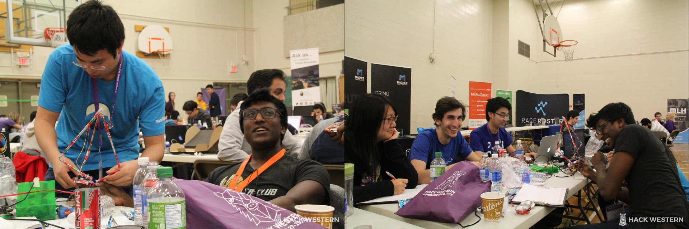
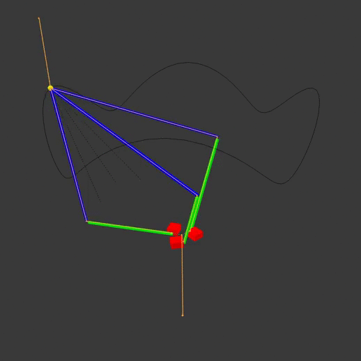
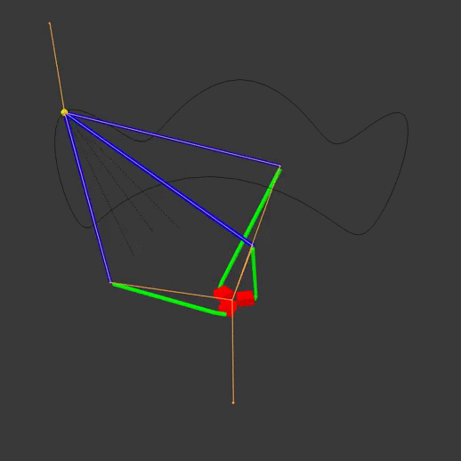
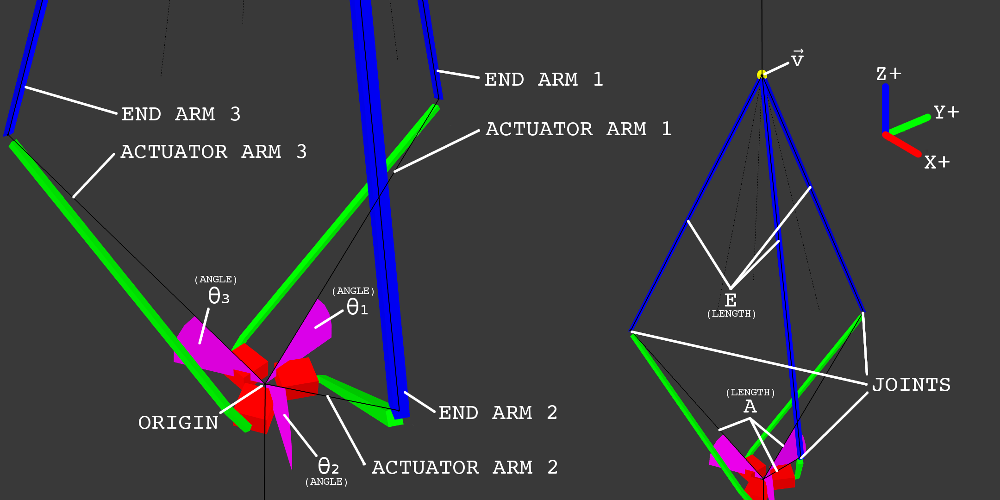
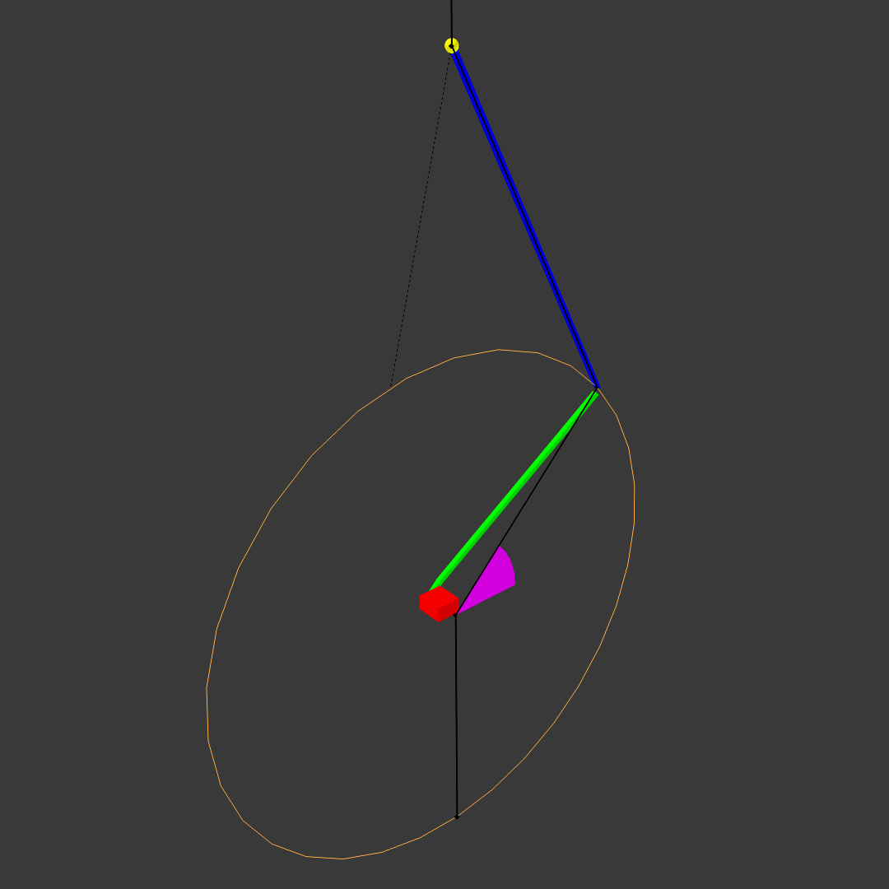
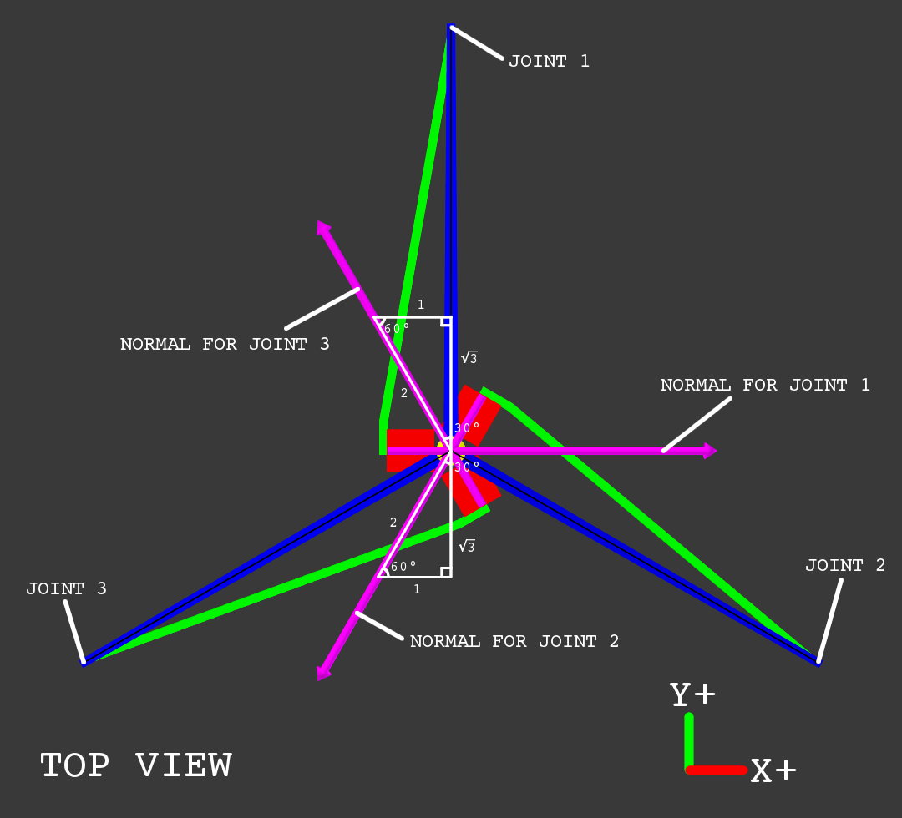
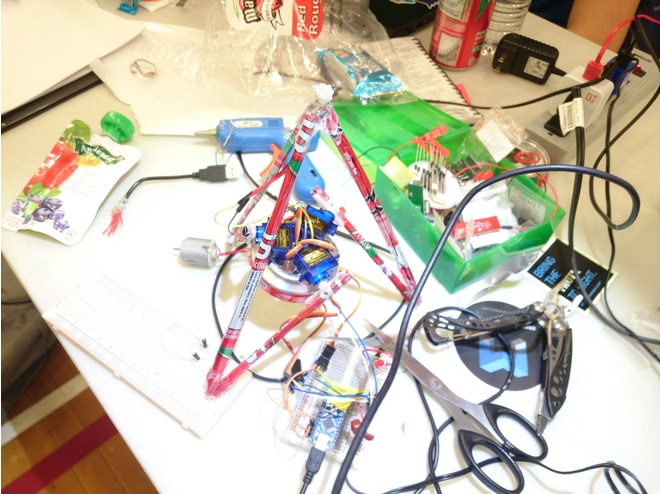
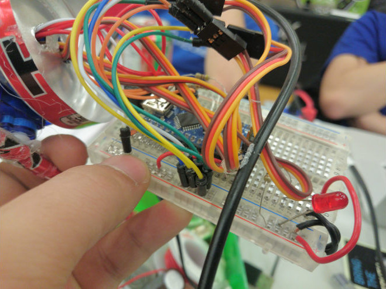
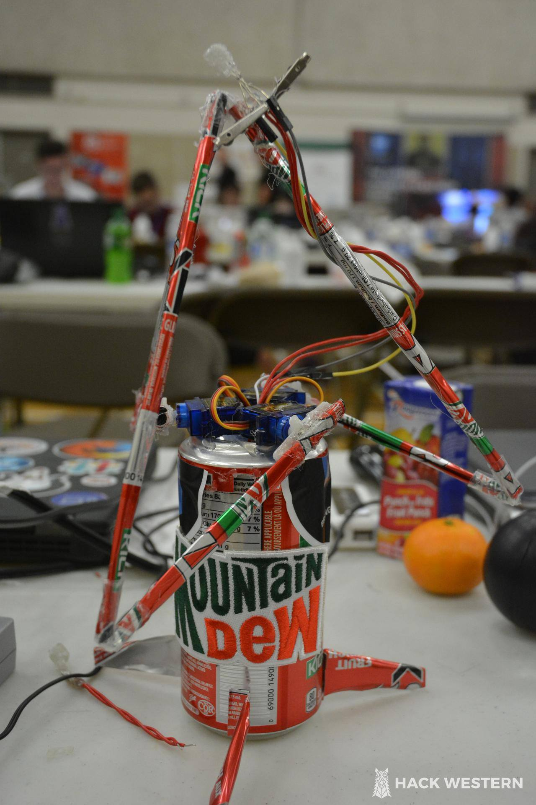

Back in November, [Hackwestern II](https://www.hackwestern.com/) saw myself and 3 teammates sitting in London, with 48 hours and no project ideas. The obvious course of action was therefore to build a [light painting](https://en.wikipedia.org/wiki/Light_painting) robot:

_(Photo credits: [HackWestern II photography team](https://web.facebook.com/hackwestern/))_

[Delta robots](https://en.wikipedia.org/wiki/Delta_robot) are commonly used for pick-and-place machines and 3D printers. The nice thing about these designs is that we don't need to move the actuators themselves. That means simpler wiring, faster motion, and better efficiency.

[LightPainter](http://devpost.com/software/lightpainter) is a delta-style robot. It rapidly moves the LED on its tip, animating the color and intensity to draw 3D shapes on long-exposure photographs:

Let's take a look at the robotics design and construction.

### Delta-style robots

LightPainter isn't strictly a delta robot, since it doesn't keep the end effector (the RGB LED) at a fixed angle with respect to the base. It also uses a somewhat unusual actuator arrangement, which results in a **smaller footprint without reducing the robot's reach** and simpler math for controlling the arms.

Delta robot kinematics are relatively well-studied. However, most papers (like [this one](http://www.ohio.edu/people/williar4/html/pdf/DeltaKin.pdf)) leave out a lot of detail, such as choosing knee orientations, edge cases and singularities, and so on. Here, we will do a more comprehensive analysis and use it to **write more robust inverse kinematics routines**.

Typical delta robots have this configuration:

The red actuators move the green actuator arms, which move the blue end arms to position the yellow end effector. The animation armature is highlighted in orange, while the path of the end effector is visible as a black line. Note that each arm pivots at **different points on the base**. By moving the actuators off to one side, we can have the **same pivot point for all three actuator arms**:

Let's solve the inverse kinematics for the latter system. First, we'll define some variables of interest:

So $$\vec v = \tup{v_1, v_2, v_3}$$ represents the XYZ-coordinate (in meters) of the robot's **end effector**, $$A$$ represents the length of the **actuator arm** (from the origin to the end of the arm), $$E$$ represents the length of **end arm**, and $$\theta_1, \theta_2, \theta_3$$ represent the **actuator angles** for arms 1 through 3, respectively. Finally, we define a coordinate system where the origin $$\vec 0$$ is the pivot point for all three actuators, and actuator 1 points toward the positive Y axis. All three actuators are 120 degrees apart from each other,

Note that on the diagram, the imaginary black lines going from the origin to the joints are the actuator arms, rather than the green pieces that the robot would actually have connected to the actuators in real life. This is done to more easily define the actuator angles and simplify the math a bit later on.

Solving the **inverse kinematics** means that we determine a function that finds $$\tup{\theta_1, \theta_2, \theta_3}$$ given $$\vec v$$. That means that given a position, we can compute the necessary actuator positions that move the end effector to that position.

We first observe that the **joint** between an actuator arm and an end arm is always on a 3D circle around its corresponding actuator's axis of rotation. This is because its position is determined purely by the actuator's rotation and the length of the actuator arm:

Let $$\theta$$ be the **angle of the actuator arm** (for example, $$\theta = \theta_2$$ for arm 2). Above, this is the angle between the black line and the horizontal plane. At $$\theta = 0$$, the actuator arm is fully horizontal; at $$\theta = 90 \deg$$ the actuator arm should be pointing straight upward, and at $$\theta = -90 \deg$$, straight downward. To ensure we always get a unique solution, we will constrain the actuator angles to between -90 and 90 degrees.

We can write a function for the position of a joint given its corresponding actuator angle, by modifying the [parametric formula for a 3D circle](http://demonstrations.wolfram.com/ParametricEquationOfACircleIn3D/), $$\vec P(t) = r \cos(t) \vec u + r \sin(t) \vec n \times \vec u + \vec C$$.

* $$\vec C$$ is the **center point** of the circle.
    * Clearly, this is $$\vec 0$$ since we previously defined the common center of rotation as the origin.
* $$\vec n = \tup{n_1, n_2, n_3}$$ is the circle's **normal** (a unit vector that is perpendicular to the surface of the circle).
    * This is different for each circle because they're all facing different directions (see diagram below).
    * The normals can be found using trigonometry - simply use the [special right triangles](https://en.wikipedia.org/wiki/Special_right_triangle) to determine the corresponding vector for each white line.
    * A circle has two possible normals, one for each side. $$P(t)$$ goes clockwise as $$t$$ increases (viewed with the normal facing away from you), so we choose the normal that makes the arm move upward as $$t$$ increases to make our math simpler.
    * The normal for arm 1 is $$\tup{1, 0, 0}$$, the positive X axis.
    * The normal for arm 2 is $$\tup{-\frac 1 2, -\frac{\sqrt 3}{2}, 0}$$, 30 degrees clockwise of the negative Y axis.
    * The normal for arm 3 is $$\tup{-\frac 1 2, \frac{\sqrt 3}{2}, 0}$$, 30 degrees counterclockwise of the positive Y axis.
* $$\vec u$$ is any vector that's **perpendicular to the normal**.
    * Since the actuator axes are all horizontal (all of the actuators are on their side), the positive Z axis vector $$\tup{0, 0, 1}$$ is always perpendicular to the normals as required.
* $$r$$ is the **radius** of the circle.
    * Clearly, this is simply $$A$$, since the radius of the circle is the shortest distance to the axis of rotation.

1. Substitute variables in $$P(t)$$: $$\vec P(t) = A \cos(t) \tup{0, 0, 1} + A \sin(t) \vec n \times \tup{0, 0, 1} + \vec 0$$.
2. Simplify: $$\vec P(t) = \tup{0, 0, A \cos(t)} + A \sin(t) \tup{n_2, -n_1, 0}$$.
3. Add vectors and simplify: $$\vec P(t) = \tup{A \sin(t) n_2, -A \sin(t) n_1, A \cos(t)}$$.

While this is a valid equation for positions given an angle, it's not the same angle we defined earlier on the diagram. As-is, at $$t = 0$$, $$\vec P(t)$$ is a vector pointing directly up, which means $$\theta = 90 \deg$$. So $$t = \theta + 90 \deg$$, and the position of the joint given $$\theta$$ is actually $$\vec P(\theta) = \vec P(t - 90 \deg) = \tup{A \sin(\theta - 90 \deg) n_2, -A \sin(\theta - 90 \deg) n_1, A \cos(t - 90 \deg)}$$.

Using the trigonometric identities $$\sin(t - 90 \deg) = -\cos(t)$$ and $$\cos(t - 90 \deg) = \sin(t)$$, this becomes $$\vec P(\theta) = \tup{-A \cos(\theta) n_2, A \cos(\theta) n_1, A \sin(\theta)}$$.

Basically, $$\vec P(\theta)$$ is an **equation for the circle traced by a joint as the corresponding actuator turns**. For each actuator angle $$\theta$$ from -90 to 90 degrees, $$\vec P(\theta)$$ will return the joint's position.

Now we observe that the distance between joints and the end effector must be $$E$$, since they are connected by end arms of length $$E$$. So $$E = \lvert \vec P(t) - \vec v \rvert$$, since $$\vec v$$ is the end effector position and $$\vec P(t)$$ is a joint position. In effect, the joint position must lie on a sphere of radius $$E$$ centred on the end effector. Since the joint also lies on one of the circles we calculated earlier, **we can determine a joint position by intersecting the joint's circle and the sphere around the end effector**.

With this, we should now be able to solve for $$\theta$$ (WARNING: LOTS OF MATH AHEAD):

1. Expand vector magnitude operator: $$E = \sqrt{\left(\vec P(\theta) - \vec v\right) \cdot \left(\vec P(\theta) - \vec v\right)}$$.
    * Note that $$\theta$$ is the only unknown here - we are given all the other values.
2. Square both sides: $$E^2 = \left(\vec P(\theta) - \vec v\right) \cdot \left(\vec P(\theta) - \vec v\right)$$.
    * In general, when we square both sides of an equation, the solutions to the squared equation is the union of the solutions to the original equation and the solutions to the original equation with one side negated. Suppose we have $$x^2 = (2 - 7)^2$$, so $$x = \pm 5$$. Clearly, the values of $$x$$ are the union of the solutions to $$x = 2 - 7$$ and $$x = -(2 - 7)$$.
    * Clearly, the left side of the equation at step 1 is positive since it is the end arm length, and the right side is non-negative since it is a square root.
    * So there is no possible solution for $$-E = \sqrt{\left(\vec P(\theta) - \vec v\right) \cdot \left(\vec P(\theta) - \vec v\right)}$$ (the equation at step 2 with one side inverted).
    * Therefore, the set of solutions (values of $$\theta$$) to the equation at step 2 is the same as that for the equation at step 1.
3. Expand dot product: $$E^2 = \left(-A \cos(\theta) n_2 - v_1\right)^2 + \left(A \cos(\theta) n_1 - v_2\right)^2 + \left(A \sin(\theta) - v_3\right)^2$$.
4. Expand and simplify: $$E^2 = A^2 \cos(\theta)^2 (n_1^2 + n_2^2) + A^2 \sin(\theta)^2 + 2 A \cos(\theta) n_2 v_1 - 2 A \cos(\theta) n_1 v_2 - 2 A \sin(\theta) v_3 + v_1^2 + v_2^2 + v_3^2$$.
5. Simplify: $$E^2 = A^2 + 2 A \cos(\theta) (n_2 v_1 - n_1 v_2) - 2 A \sin(\theta) v_3 + v_1^2 + v_2^2 + v_3^2$$.
    * $$\vec n$$ is a normal vector, so it has magnitude 1. Since the normals are all horizontal, the Z axis component is 0 and $$n_1^2 + n_2^2 = 1$$.
    * The [Pythagorean trigonometric identity](https://en.wikipedia.org/wiki/Pythagorean_trigonometric_identity) says that $$\sin(\theta)^2 + \cos(\theta)^2 = 1$$.
6. Rearrange: $$\frac{1}{2 A} \left(E^2 - A^2 - v_1^2 - v_2^2 - v_3^2\right) = \cos(\theta) (n_2 v_1 - n_1 v_2) - \sin(\theta) v_3$$.
7. Let $$x = \frac{1}{2 A} \left(E^2 - A^2 - v_1^2 - v_2^2 - v_3^2\right), y = n_2 v_1 - n_1 v_2, z = v_3$$.
8. Change variables: $$x = y\cos(\theta) - z\sin(\theta)$$.
9. Substitute trigonometric identity and rearrange: $$x + z \sin(\theta) = y \sqrt{1 - \sin(\theta)^2}$$.
    * The [Pythagorean trigonometric identity](https://en.wikipedia.org/wiki/Pythagorean_trigonometric_identity) says that $$\cos(\theta) = \pm \sqrt{1 - \sin(\theta)^2}$$.
    * For $$-90 \deg \le \theta \le 90 \deg$$, $$\cos(\theta) = \sqrt{1 - \sin(\theta)^2}$$ since $$\cos(\theta) \ge 0$$.
10. Square both sides: $$\left(x + z \sin(\theta)\right)^2 = y^2 \left(1 - \sin(\theta)^2\right)$$ (and later, pick solutions that also satisfy equations from before step 10).
    * As mentioned in step 2, the set of solutions to an equation with both sides squared is a superset of the set of solutions to the original, non-squared equation.
    * That means later on, we can simply find all solutions to the squared equation, and then test each one to see if it is also a solution to the non-squared equation to solve the non-squared equation.
11. Simplify and rearrange: $$\left(y^2 + z^2\right) \sin(\theta)^2 + \left(2xz\right) \sin(\theta) + \left(x^2 - y^2\right) = 0$$.
12. Let $$a = y^2 + z^2, b = 2xz, c = x^2 - y^2$$.
13. Change variables: $$a \sin(\theta)^2 + b\sin(\theta) + c = 0$$.
14. Solve for $$\sin(\theta)$$: $$\sin(\theta) = \frac{-b \pm \sqrt{b^2 - 4ac}}{2a} = \frac{-2xz \pm \sqrt{\left(2xz\right)^2 - 4\left(y^2 + z^2\right)\left(x^2 - y^2\right)}}{2\left(y^2 + z^2\right)}$$.
    * The [quadratic formula](https://en.wikipedia.org/wiki/Quadratic_formula) can be used to solve any quadratic equation.
    * Note that the denominator could be 0, giving an undefined result. This means that the end effector position doesn't have a unique solution.
    * For example, if $$A = E$$ (actuator arms and end arms have same length), and the end effector is moved to $$\vec 0$$ (by setting $$\theta_1 = \theta_2 = \theta_3 = 0$$), then the actuators can be moved arbitrarily while the end effector stays in place - the end effector can get stuck if we move it to the origin.
    * We'll simply check if the denominator is 0, and disallow moving the end effector to that position to prevent it from getting stuck.
15. Expand and simplify: $$\sin(\theta) = \frac{-xz \pm \sqrt{y^2 \left(y^2 + z^2 - x^2\right)}}{y^2 + z^2}$$.
    * This gives us 2 possible values of $$\sin(\theta)$$ due to the $$\pm$$.
16. Choose the value of $$\sin(\theta)$$ that also satisfies equations from before step 10.
    * For each of the two values of $$\sin(\theta)$$, substitute it into the equation for step 9, $$x + z \sin(\theta) = y \sqrt{1 - \sin(\theta)^2}$$, and check if it is the solution. $$S$$ is the value that is a solution.
17. Isolate $$\theta$$: $$\theta = \arcsin\left(\sin(\theta\right)$$.
    * For $$-90 \deg \le \theta \le 90 \deg$$, $$\arcsin\left(\sin(\theta)\right) = \theta$$.
    * Note that when $$\theta < -90 \deg \lor 90 \deg < \theta$$, $$S$$ can be a solution for the equation at step 9 while not being a solution for the equation at step 8 - when the angle isn't between -90 and 90 degrees, $$\cos(\theta) = \sqrt{1 - \sin(\theta)^2}$$ from step 9 doesn't always hold. So when the end effector is in a position where one of the actuators needs to turn outside of that range, there could be incorrect results.
    * We can detect this by explicitly checking if $$\theta$$ is a solution to an equation from step 8 or earlier. If it isn't, then $$\theta < -90 \deg \lor 90 \deg < \theta$$ and there is no solution.

This is quite straightforward to implement in code. Here, I'm using Python 3 to demonstrate the concepts, but this can trivially be translated into a lower level language:


def inverse_kinematics(end_position, actuator_arm_length, end_arm_length):
    """Computes the angles of the three actuators in a delta robot given the end effector position `end_position`, actuator arm length `actuator_arm_length`, and end arm length `end_arm_length`."""
    # check inputs
    assert len(end_position) == 3, "End effector position must be a 3-tuple of numbers"
    float(end_position[0]), float(end_position[1]), float(end_position[2])
    assert actuator_arm_length > 0, "Actuator arm length must be a positive number"
    assert end_arm_length > 0, "End arm length must be a positive number"

    arm_1 = inverse_solve_actuator(end_position, (1, 0, 0), actuator_arm_length, end_arm_length)
    if arm_1 is None: return None
    arm_2 = inverse_solve_actuator(end_position, (-1 / 2, -math.sqrt(3) / 2, 0), actuator_arm_length, end_arm_length)
    if arm_2 is None: return None
    arm_3 = inverse_solve_actuator(end_position, (-1 / 2, math.sqrt(3) / 2, 0), actuator_arm_length, end_arm_length)
    if arm_3 is None: return None
    return (arm_1, arm_2, arm_3)

def inverse_solve_actuator(end_position, actuator_normal, actuator_arm_length, end_arm_length):
    # compute constants
    x = (end_arm_length ** 2 - actuator_arm_length ** 2 - end_position[0] ** 2 - end_position[1] ** 2 - end_position[2] ** 2) / (2 * actuator_arm_length)
    y = actuator_normal[1] * end_position[0] - actuator_normal[0] * end_position[1]
    z = end_position[2]

    # solve for possible values of sine theta
    determinant = y ** 2 * (y ** 2 + z ** 2 - x ** 2)
    if determinant < 0: # no solution exists
        return None
    denominator = y ** 2 + z ** 2
    if denominator == 0: # arm lock, don't allow moving here to avoid getting stuck
        return None
    sin_theta_A = (-x * z + math.sqrt(determinant)) / denominator
    sin_theta_B = (-x * z - math.sqrt(determinant)) / denominator

    # choose the value that is a solution
    # since we're using floats, we choose the sine theta value with the smaller error
    error_sin_theta_A = abs(x + z * sin_theta_A - y * math.sqrt(1 - sin_theta_A ** 2))
    error_sin_theta_B = abs(x + z * sin_theta_B - y * math.sqrt(1 - sin_theta_B ** 2))
    theta = math.asin(sin_theta_A if error_sin_theta_A < error_sin_theta_B else sin_theta_B)

    epsilon = 1e-10
    if abs(y * math.cos(theta) - z * math.sin(theta) - x) > epsilon:
        return None
    return theta


### Physical construction

The design was pretty much made up as we went along, based on what materials could be scavenged. For example, the base and arms were all made out of empty Mountain Dew cans and assorted litter found around the room. The bottom of a soda can became the base for the arms:

Since we didn't have any universal joints, actuator arms and end arms were joined together by gluing them to flexible strips cut from ziplock bags. This actually behaves a lot like a universal joint, if you don't think about it too much. The arm actuators are SG90 servos (nylon-geared analog micro servos, generally about $3 each).

On top you can see the robot's end effector, an RGB LED. This was given to us by a generous fellow participant, and appropriately covered in hot glue to diffuse the light. We didn't have a soldering iron, so electrical connections were made using alligator clips and female/female jumpers. An Arduino Nano acts as the controller. With 6 PWM outputs, there were exactly enough pins to control the 3 servos and fade the 3 channels of the RGB LED. Overall, the circuitry and code was pretty straightforward:

Despite our best efforts, the robot actually worked!

<iframe width="420" height="315" src="https://www.youtube.com/embed/mHgd_Hp3V_M" frameborder="0" allowfullscreen></iframe>

### Wrap-up

With better motion control, the movements can be made a lot smoother, increasing the quality of the resulting photo - perhaps a good project for another time. For now, LightPainter sits on my desk, occasionally flashing and spinning around.

Project files and links:

* The [Blender file used to render the graphics in this document](mechanics.blend).
* The full source code for the [inverse kinematics routines](inverse_kinematics.py).
* The [controller code running on the Arduino](https://github.com/Uberi/LightPainter).
* The [DevPost submission](http://devpost.com/software/lightpainter) for LightPainter.

And one more photo, for good measure:

