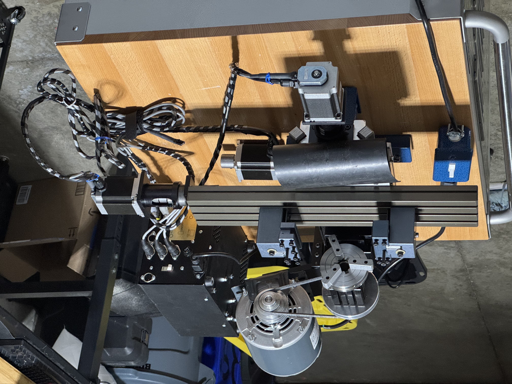
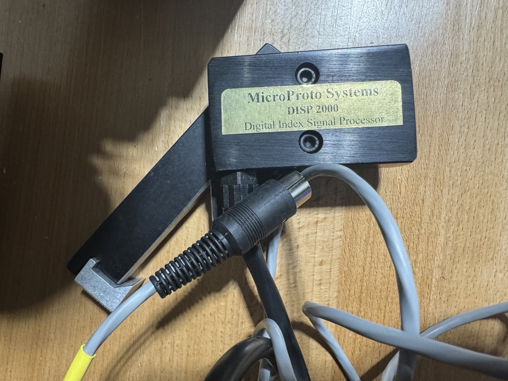

We recently acquired a used [Taig MicroMill 2019DSLS CNC mill](https://taigtools.com/product/micro-mill-2019dsls/), in great condition and just 8 years old. Even though there's already a fancier CNC mill in our workshop, we were sorely missing a small metalworking lathe for a few projects, and found it hard to resist such a good deal. Let's turn this thing into a CNC lathe!

(Forgot to take "before" pictures. Here's the official product photo instead.)

See the last section below for design files and a bill of materials.

Aside: Taig mill and lathe model numbers
----------------------------------------

Since I haven't seen this explained online, this is what the "2019DSLS" in the model name actually means for a Taig mill:

* The 2000-series models have leadscrews, while the 5000-series models have ballscrews. So the 2019DSLS has leadscrews, which would typically be suboptimal for a mill (climb milling would be quite difficult due to backlash), but perfectly fine for a lathe if using software backlash compensation.
* The "19" models have 12" X-axis travel and the fixed-speed spindle motor, while the "18" models have 9.5" X-axis travel and the fixed-speed spindle motor, and the "23" models have 12" X-axis travel and the variable-speed spindle motor. So the 2019DSLS has the larger X-axis travel option, which will give us 12" of cross-slide travel (plenty of room for gang tooling), and a fixed-speed spindle motor, which is fine for our purposes since changing the speed on a lathe is a significantly less frequent operation than for a mill.
* The "DSLS"-suffixed models use closed-loop steppers, while "CNC"-suffixed models use open-loop steppers, and "CR"-suffixed models come with bare motor mounts for your own steppers. So the 2019DSLS has closed-loop steppers. Even though the typical advantage of these is slightly higher speeds, in my opinion, the real benefit is being able to detect and recover from certain kinds of issues automatically, which is why all of my CNC machines use closed-loop motors regardless of the potential speed benefits.

The mill-to-lathe conversion essentially turns the mill into something equivalent to the [TaigTurn 3019DSLS](https://taigtools.com/product/taigturn-3019-dsls-full-cnc-lathe/). Here's what the "3019DSLS" in the model name actually means for a TaigTurn lathe:

* The 3000-series models have leadscrews, while the 4000-series models have ballscrews.
* The "19" models have an ER16 headstock, while the "29" models have a 5C headstock.
* The "DSLS"-suffixed models use closed-loop steppers, while "CR"-suffixed models use open-loop steppers, and "MAN"-suffixed models come with handwheels for manual operation.

Mill to lathe conversion
------------------------

Adding the lathe headstock, tool holders, and drive system is relatively simple - Taig actually just sells a quite reasonably-priced package for this, the [4100ER mill-to-lathe conversion kit](https://taigtools.com/product/4100er-taig-mill-to-lathe-kit-er16-headstock/).

You could even skip the [300-00ER lathe spindle](https://taigtools.com/product/300-00er-complete-er-headstock-for-lathe/), since the mill's existing [200-00ER spindle](https://taigtools.com/product/complete-headstock-with-er-spindle/) is usable for this purpose, as well as the [1040ER ER16 collet set](https://taigtools.com/product/1040-er16-collet-set/), since you probably already have these from the mill anyways. It's possible to skip the [1021WIRED 1/4hp motor](https://taigtools.com/product/marathon-motor-1-4-hp/) and reuse the mill's existing spindle motor too, but this is more involved because you'd have to make a custom motor mount.

Although there weren't any instructions included, it's not difficult to figure out how all the pieces fit together from the product photos online. An hour or two of assembling and re-assembling, and we've got the mechanical components set up and working.

For the motors, we'll reuse the X-axis and Z-axis motors from the mill. There ends up being an unused Y-axis motor attached to the cable harness, but we'll just put it somewhere out of the way. For the breakout board/motor driver, we're reusing the Taig mill controller box and the [CNCdrive UC100 motion controller](https://cncdrive.com/UC100.html) that were both bundled with the mill.

For the software, we're using Artsoft's Mach3Turn on the same Windows machine that we use for CAM, connected to the UC100 via USB. Because the UC100 handles all of the real-time tasks, we don't need to worry about the OS latency or real-time capabilities on this machine. The standard Mach3Turn setup works fine here, with the only special configuration needed being the input signals for the DSLS closed-loop steppers (more on this topic below):

(Excuse the low-quality photos - we can't use screenshots from this machine due to the airgapped setup)

Spindle indexing sensor
-----------------------

A spindle indexing sensor is crucial for thread cutting operations, which is one of the big reasons we needed a lathe in the first place. Each pass of the thread cutting operation has to cut deeper in the exact same groove as the previous pass, which means that the controller needs to know the angle of the spindle when starting the cut.

First, we obtained Taig's official spindle indexing sensor, the "Digital Indexing Signal Processor" (DISP). We don't have the manual or any official documentation about it, and we don't want to damage the DISP or the controller box by just trying to plug them together, so the best place to start would be to take everything apart to see how it all works.

The DISP is a small metal box with a purple sensor head on one side, and on the other side, a wire that has an DIN-45326 (type 8A) plug (also known as the "DIN-8 270-degree connector") on the end, designed to plug into the back of the TaigTurn controller box:

Note that there are many circular connectors that are called "8-pin DIN", but only DIN-45326 (type 8A) looks like a pin slightly offset from the middle, with a circle of 7 pins around the middle and a gap in the circle at the connector's keyway. When looking for DIN plugs or receptacles, always check the photo to make sure it matches. The [MSX wiki's page about these connectors](https://www.msx.org/wiki/RGB_%288-pin_DIN_45326%29) is a great reference:

The spindle pulley has a steel insert that looks like it's designed to trigger the sensor:

The sensor's tip is opaque and the spindle pulley's steel insert isn't magnetized, so the sensor couldn't be an optical or hall-effect type, making it very likely to be an inductive sensor. Our guess is that the inductive sensor's spacing is adjusted so that the steel insert triggers the sensor, but the aluminum pulley doesn't (aluminum is harder than steel for inductive sensors to detect).

### Understanding how the DISP works

Taking apart the DISP, it has an inductive sensor with three wires, blue/brown/black, which for this type of sensor almost always means ground/power/sensor-output, respectively. On the other side is the DIN-45326 (type 8A) plug, where there are three wires, white/blue/black, connected to three of the eight pins of the connector:

Taking apart the sensor cable, we've figured out that the sensor's blue/brown/black wires map to blue/white/black wires at the connector, respectively.:

We can now try using the DISP in our own circuit. After crimping on some pin headers and testing at various voltages and circuit configurations, we figured out that it's definitely an inductive sensor, with a 4V minimum operating voltage (uncommon, usually it's 10V minimum), a 6mm sensing distance (somewhat uncommon, usually it's 2mm-4mm for these 12mm sensors), and the output is NPN open-collector (very common, almost all sensors use this):

We couldn't measure the maximum operating voltage since we didn't want to break it, but it's likely this sensor is designed to be powered from 5V. The response frequency was at least 500Hz, which matches most other inductive sensors on the market, though it's possible that the maximum response frequency is higher.

### Understanding how the Taig mill controller box works

We don't have a TaigTurn controller box, but we do have a Taig mill controller box, and this box has an I/O port in the form of a DIN-45326 (type 8A) receptacle, shown with a corresponding DIN-45326 (type 8A) plug for reference:

Could we just plug the DISP into the TaigTurn controller box? To answer this, I obtained the pinout of the I/O port from a [forum post on IndustryArena](https://en.industryarena.com/forum/i-o-port-pinout-taig-microproto--428664.html), combined with the pin mapping from my other Taig mill's user manual:

We then took apart the controller and used the pinout diagram to start figuring out what each pin is connected to:

Looking at the traces coming out of the I/O port connector, we found that all of them except GND were connected to a strange-looking component labelled "10X-1-102LF":

This seems to be a [Bourns 4610X-101-102LF resistor network](https://www.digikey.com/en/products/detail/bourns-inc/4610X-101-102LF/1089168), which according to the datasheet, connects pin 1 to each of the other pins by a 1kOhm resistor:

Pin 1 of this resistor network is connected to the output of an [ST LM7805CV 5V 200mA linear regulator](https://www.digikey.com/en/products/detail/stmicroelectronics/L7805CV/585964), and pins 2 though 8 are connected to the 7 non-GND pins of the I/O port.

Each of the I/O port pins were also directly connected to specific pins on the parallel port:

Additionally, the Xin/Yin/Zin/Ain pins were each connected to one of the four "DSLS V2.1" DIP components. Peeling back the label on one of those components reveals that it's a PIC18F microcontroller:

Each microcontroller is likely a DSLS processor for one axis, continuously checking that the motor encoder results match the commanded motor movements, and pulling an "error output" pin low when a discrepency is detected. The pins that Xin/Yin/Zin/Ain were connected to on each "DSLS V2.1" component is likely to be that "error output" pin.

Summarizing our findings, we can now describe each pin of the I/O port:

* GND is ground on the parallel port, which makes up pins 18 to 25 inclusive on the parallel port.
* OUT1 and OUT2 are general purpose outputs, not used by the controller for anything. These correspond to pins 16 and 17 on the parallel port, respectively
* EMO is a general purpose input, and also has a ~1kOhm pullup to 5V inside the controller. It corresponds to pin 10 on the parallel port.
* Xin/Yin/Zin/Ain are general purpose inputs that are also connected to each axis' DSLS closed-loop motor "error output" pin, and also have a ~1kOhm pullup to 5V inside the controller. These correspond to pins 11, 12, 13, 15 on the parallel port, respectively.
* The pins of the I/O port are directly connected to the parallel port, so the I/O port shares a common ground with the computer. Also, there are no filters, clamps, or chokes on these pins, so we would need to add those externally when connecting long cables that could pick up damaging levels of EMI.

From this pinout diagram, if we plugged the DISP directly into the I/O port, white/brown (power) on the DISP would go to EMO (parallel port pin 10) on the controller's I/O port, blue (ground) would go to GND, and black (sensor output) would go to Ain (parallel port pin 15). Blue is supposed to be GND, and Ain would indeed be a suitable pin to use with for the sensor output, especially since CNC lathes almost never have an A axis to occupy these pins for other purposes. However, powering the sensor from EMO's 5V pullup wouldn't work reliably under all temperature and EMI conditions, because even at 1mA DISP supply current, the pullup would drop the voltage by 1V, barely reaching the minimum operating voltage. To make this work, the TaigTurn controller must have some sort of 5V power supply pin where this controller has its EMO pin.

Later, we managed to borrow a 2024-era Taig mill controller box for comparison purposes. Here's what it looks like inside:

As it turns out, this controller has exactly the difference we expected to see in the TaigTurn controller, a 5V power supply pin where the older controller has its EMO pin! Perhaps the TaigTurn controller is exactly the same product? It would make sense from a design perspective since they're meant to perform the exact same kinds of motor control tasks.

That means above pinout diagram is inaccurate for newer Taig mill controllers - although EMO is still an input pin tied to pin 10 of the parallel port, it's tied to 5V directly through a wire jumper instead of through a ~1kOhm pullup (trace highlighted with a red line):

The wire jumper is likely meant to be cut if you want the I/O port to have the same behaviour as the ones on older Taig controller boxes, like the one I have. If you had a newer Taig mill controller box (internally labelled DSLS v3.0 or later), you could just plug in the DISP and it would work, as long as you didn't need to access any other pins on the I/O port! Likewise, we could easily modify our older Taig controller box to work with the DISP in the same way, by bodging a wire between the EMO pin and the 5V output of the regulator.

### Using a custom spindle indexing sensor

Although we've managed to make the DISP work with the controller box, it still has two problems if we want to actually use it with our current setup. First, it takes up the entire I/O port of the Taig mill controller box, leaving no pins free for limit switches, coolant control, etc. This means we'll need to make a special DIN-45326 (type 8A) cable that breaks out the other pins for limit switches.

The other issue with the particular DISP we have is that this one is designed to be mounted on the variable-speed spindle motor TaigTurn lathe, where the DISP is mounted on the motor rail and points to an aluminum disk attached to the end of the spindle pulley:

While the regular fixed-speed spindle motor TaigTurn uses a totally different mounting design, where the DISP is mounted on an arm attached to the spindle, and points to the flat end of the spindle pulley:

To solve this, we could purchase the second variant's mounting hardware, or purchase the first variant's spindle pulley (or perhaps the aluminum disk is a separate part that just mounts to the same shaft as the spindle pulley?). However, at this point we didn't feel like reassembling the DISP unit again, and figured it was probably more fun to make something custom, especially now that we understand how the DISP works.

To summarize what we've learned so far, the DISP is an inductive sensor that generates a single active-low pulse on each revolution of the spindle (since the steel insert would pass by the sensor once per revolution). This pulse is then passed directly to the controller, which can then use that information to synchronize axis motions with the position of the spindle.

We'll first design and 3D print a mounting bracket for a standard 12mm diameter inductive sensor that holds it right in front of the steel insert on the spindle pulley:

It took a few tries to get the measurements exact, but finally the mounting bracket secures to the T-slots at the top of the spindle via #10-24 5/8" bolts and standard #10-24 nuts, and holds the inductive sensor right up against the spindle pulley's steel insert. Pulley ratio changes are still straightforward with this bracket in place, since it doesn't block access to the drive belt:

For the inductive sensor, we'll use a [GTRIC LR12-02N1](https://www.aliexpress.com/item/1005005248933829.html), which has an NPN-open-collector normally-open output, a 10V-30V operating voltage, a 2mm sensing distance, and a 500Hz response frequency:

At 500Hz and a 50% duty cycle (the usual assumption for response frequency specifications), the sensor can support a minimum on-time and off-time of 1ms. The max lathe speed is 1800rpm, going by the [TaigTurn product page](), so 30 revolutions per second. If the steel insert triggers the sensor for around 10% of each revolution, that corresponds to an on-time of 3.3ms at max speed. The response frequency of this sensor should be more than enough to sense every revolution, even at max speed.

The sensor should be adjusted so there is around 1mm of space between the sensor and the spindle pulley, and then the bolts can be tightened:

Limit switches, motors, and other electronics setup
---------------------------------------------------

We'll install the 3D printed limit switch mounts that we made for the Taig mill (a topic for a future post), except we'll only need the X-axis and Y-axis ones (since the Y-axis on the mill becomes the Z-axis on the lathe in the mill-to-lathe conversion):

Now we can connect the limit switches and spindle index sensor to the I/O port of the Taig mill controller box (and an external 12V power adapter) as follows:

To power the limit switches and spindle index sensor, we'll use a 12V 2A power adapter with a 5.5mm OD/2.1mm ID barrel jack plug. It comes with a matching barrel jack receptacle that connects to a 2-pin screw terminal, perfect for point-to-point wiring.

To connect the wiring to the I/O port of the Taig mill controller, we'll cut a DIN-45326 (type 8A) cable in half, and solder the 8 lines to their own pins on an 8-pin screw terminal, labelled according to the pinout diagram above:

Now we can wire everything up according to the schematic. We crimped ferrules onto all of the wire ends, then joined everything using Wago terminal blocks:

It looks a bit messy, but this approach is reliable and easy to modify/repair! While ferrules aren't strictly needed with Wago terminal blocks, they provide some extra strain relief, and make the wiring easier to inspect.

Software Setup
--------------

In Mach3Turn, the limit switches/homing switches and spindle index sensor pins should be configured as active-low inputs under "Config > Ports & Pins > Input Signals" (these should be the only input signals enabled):

The motor outputs should be set up according to the defaults, here they are for posterity:

To make spindle indexing work properly, we also need to check "Use Spindle Feedback in Sync Modes" under "Config > Ports & Pins > Spindle Setup", which (from my current understanding) causes the UC100 to delay the execution of each G-code operation until the next spindle index sensor pulse comes in. That means each operation starts at the same relative position of the spindle, allowing each threading pass to cut into the same groove:

We also find that results are slightly better with the "Spindle Speed Averaging" setting enabled (which smooths out small variations in spindle speed over time), but that's likely because of some of the limitations of the spindle indexing sensor, which we'll talk about below.

One limitation of the UC100 is that you can only use one at a time with one computer. However, we have two UC100s and one computer, one for the mill and one for the lathe. For security reasons, all control-related computers are airgapped, so adding another computer would make the setup a lot more complicated due to how our data diodes are configured. Instead, we'll use a bidirectional USB switcher to select between the two UC100s with a button (shown next to the spindle on/off switch):

Limitations and future work
---------------------------

This is a quick-and-dirty way of getting some essential functionality working so we could start making parts. It would be pretty simple to turn this into a PCB with a nice enclosure and panel-mount connectors, but if you're running a lathe like this one, you'd probably prefer to make this sort of thing yourself.

One limitation with our current spindle indexing setup is that the inductive sensor only outputs one pulse per revolution, so less than 100Hz compared to the multi-kHz control loops inside the controller. This means the controller takes dozens of milliseconds to detect that the spindle speed has changed and modify the Z-axis feed rate to match, resulting in localized inaccuracies in the thread.

This is perfectly acceptable for our purposes, since the spindle speed should not be changing much anyways while making lighter cuts, but we could improve this by replacing the indexing sensor with a high-resolution spindle encoder, which would give thousands of pulses per revolution instead of just one. The controller could then start responding within dozens of microseconds rather than dozens of milliseconds. Mach3 doesn't support spindle encoders that output more than one pulse per revolution, so if we did this upgrade, we'd also need to switch to something that does (UCCNC, Mach4, LinuxCNC).

The other limitation is specific to using Mach3 together with the UC100. The Mach3 plugin architecture only allows the UC100's Mach3 plugin to synchronize the threading operation with the spindle position at the very beginning of the threading operation, with no ability to adjust the Z-axis feed rate while the threading operation is in progress. This means that if the spindle speed changes halfway through a cut, the Z-axis feed rate won't change at all, giving the thread an inconsistent pitch.

This generally isn't a problem, for the same reason as for the first limitation, but the solution for this would also involve switching away from Mach3Turn. According to the CNCDrive development team, [the UC100 Mach4 plugin doesn't support threading](https://forum.cncdrive.com/viewtopic.php?t=3156), so Mach4 is out. In [this post on the official CNCDrive forums](https://forum.cncdrive.com/viewtopic.php?t=3984), CNCDrive recommends using their software, [UCCNC](https://cncdrive.com/UCCNC.html), instead. LinuxCNC should also support this with its [Spindle Synchronized Motion](https://linuxcnc.org/docs/html/examples/spindle.html#_spindle_synchronized_motion) functionality. From what we can tell, most people seem to end up using UCCNC with this kind of setup.

Another way to improve both of these would be to use a closed-loop spindle motor, such as one of the [spindle motor upgrade kits offered by GlockCNC](https://glockcnc.com/store/#!/Sherline-&-Taig-Brushless-Motor-Upgrade-750-Watt-CNC-Controllable/p/34923060) - if the spindle speed doesn't change, then the Z-axis feed rate doesn't need to change either. You'd still need the one-pulse-per-revolution sensor to keep track of the spindle's position, but you can otherwise assume that the spindle speed stays constant. This isn't as good as a proper spindle encoder, since the bandwidth of the motor's speed control loop will almost certainly be a lot lower than that of a controller's Z-axis feed rate control loop, but would likely still get pretty good accuracy.

We originally wanted to make the spindle indexing sensor mount out of aluminum at some point, but now it's hard to justify when the 3D-printed version has been working so well. The easiest way would probably be to drill out the sensor hole and mounting holes in a strip of 4mm thick aluminum, and then use a press brake to bend it into a similar question-mark-shape.

And now, a picture of the final setup. Overall, very happy with how this lathe conversion turned out:

Downloads
---------

* [3D-printable mount for the spindle indexing sensor (STL format)](./lathe-indexing-sensor-mount.stl)
* [KiCAD (version 9.0) project used to make the schematic drawing above](./hardware.zip)
* [FreeCAD (version 1.0.0) project used to design the mount for the spindle indexing sensor, including a model of the sensor and the mounting hardware](./lathe-indexing-sensor-mount.FCStd)

Shopping list (besides the used Taig MicroMill 2019DSLS CNC mill):

* [LR12-02N1 (12mm diameter, 2mm sensor range, NPN output, normally open) inductive sensor](https://www.aliexpress.com/item/1005005248933829.html) (one for the spindle indexing sensor, two for the X-axis limit switches)
* [LR12-02N2 (12mm diameter, 2mm sensor range, NPN output, normally closed) inductive sensor](https://www.aliexpress.com/item/1005005248933829.html) (two for the Y-axis limit switches)
* [assorted Wago 222-series terminal blocks](https://www.amazon.ca/Terminal-Assortment-Positions-Shrink-Plastic/dp/B01GVTVY12)
* [12V 2A power adapter with barrel-jack-to-screw-terminal adapter](https://www.amazon.ca/dp/B01AZLA9XQ)
* [cable with double-ended DIN-45326 (type 8A) plugs, 50cm length](https://www.amazon.ca/dp/B0CCVH5LM7) (these can be snapped together to make longer terminal blocks, for our purposes we need an 8-pin block made out of two 4-pin blocks snapped together)
* [assorted screw terminal block set, 5mm pitch](https://www.amazon.ca/JZK-Terminal-5mm-Pitch-Blocks-Connectors/dp/B0BNHMNCFK)
* [4100ER mill-to-lathe conversion kit, ER16 headstock](https://taigtools.com/product/4100er-taig-mill-to-lathe-kit-er16-headstock/) (minus the [300-00ER lathe spindle](https://taigtools.com/product/300-00er-complete-er-headstock-for-lathe/) and [1040ER ER16 collet set](https://taigtools.com/product/1040-er16-collet-set/))
* [1030ER independent 4-jaw chuck](https://taigtools.com/product/chuck-4-jaw-3-1-4-dia-3-4-16thd/)
* Other tooling as needed, e.g. [lathe turning tools](https://www.amazon.ca/LYMMIYTC-Indexable-Turning-Grooving-Threading/dp/B0CQPBNQG9) (high-speed steel and indexed carbide), Jacobs drill chucks (with 3/8" drill chuck arbors), etc.
