Early last year, I wrote an addon for [Blender](http://www.blender.org/) called [Resolve Camera Tracks](https://github.com/Uberi/MotionTracking), which implements the ability to reconstruct the 3D location of points using two or more 2D videos.

Version 1.1 of this addon has just been released! This post will demonstrate a full tracking workflow, from video acquisition to the final, animated result.

We're going to be going from this:

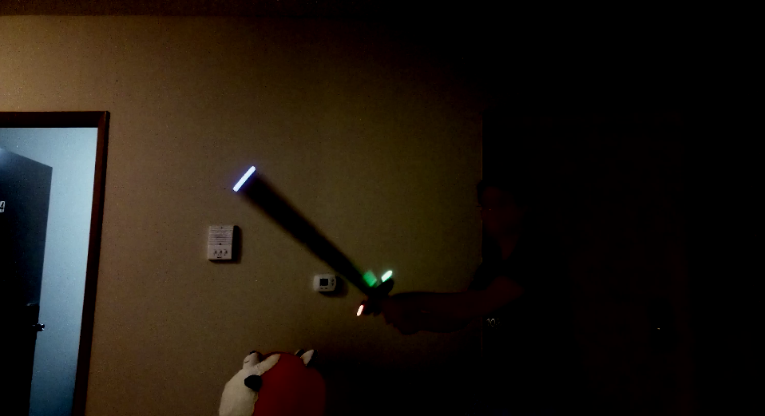

To this:

### Step 1: Make a tracking setup

We're going to need **at least two cameras**. For demonstration purposes, I'm using an old LG Optimus L9, and a Sony Xperia Z3C. The camera on the LG phone isn't that great, but it'll do the job. As before, more cameras will result in more accurate results.

The first thing we need to do is **figure out the camera properties** - we'll need this for calibration later. You can do this by taking a picture with each camera and checking the EXIF data in the resulting image files, but I just looked up the specs online and in the user manuals:

    Z3C focal length: 4.6mm
    Z3C sensor size: 1/2.3" (11.04mm)
    LG focal length: 4.6mm
    LG sensor size: 1/4" (6.35mm)

It's time to set up our tracking rig. With two cameras, the best configuration is to have perpendicular cameras capturing the same area (the best arrangement covers the largest possible number of angles you will be using):

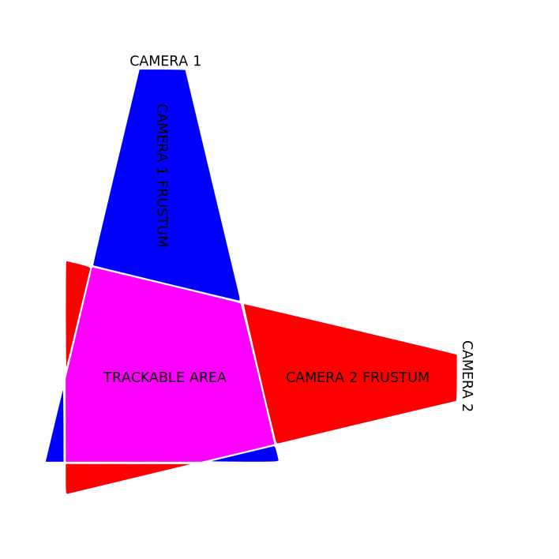

Let's set that up:

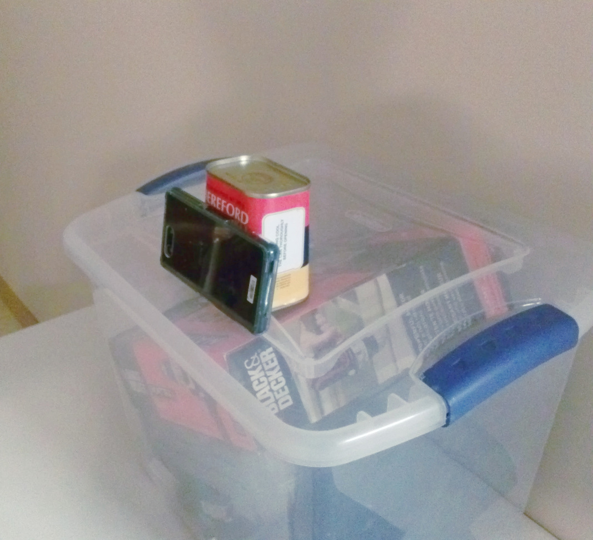

As it turns out, corned beef makes an excellent phone stand!

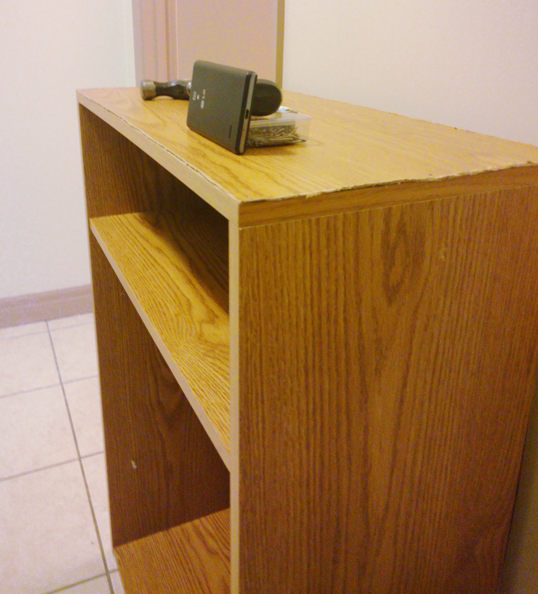

Just like in the diagram, we've placed the cameras **facing the same spot, at right angles to each other**. I've moved the cameras around until both of them could reliably capture the same area from different angles. This took a few takes but was pretty simple to do overall.

Now, we need to pick a point to be our reference/origin. For convenience, I picked the spot that both of the perpendicular cameras are pointing toward, and marked it on the ground:

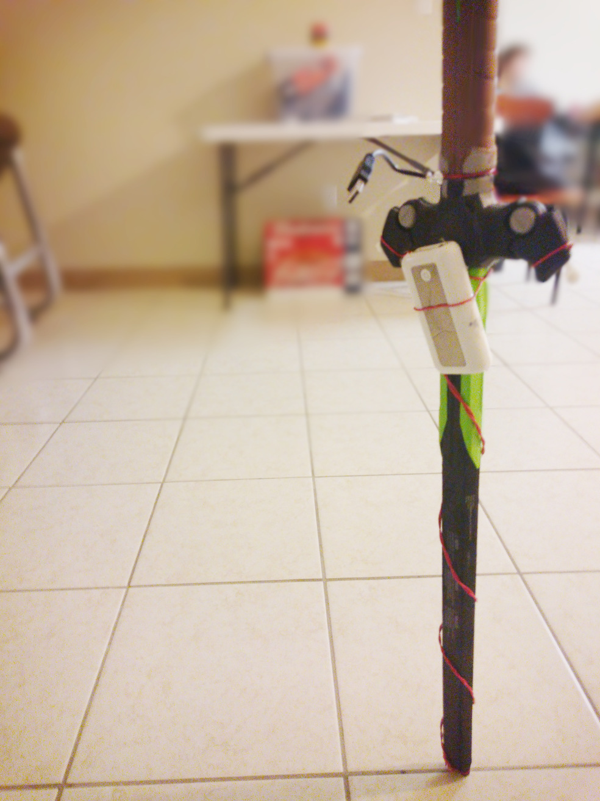

To be able to reconstruct this scene later, we'll need to **measure the position of each camera relative to the reference point**. Since each camera is directly facing the reference point, we only need to measure the distance, height, and angle of the camera in order to fully specify its position in 3D space. For each camera, make sure to obtain each of the indicated blue measurements:

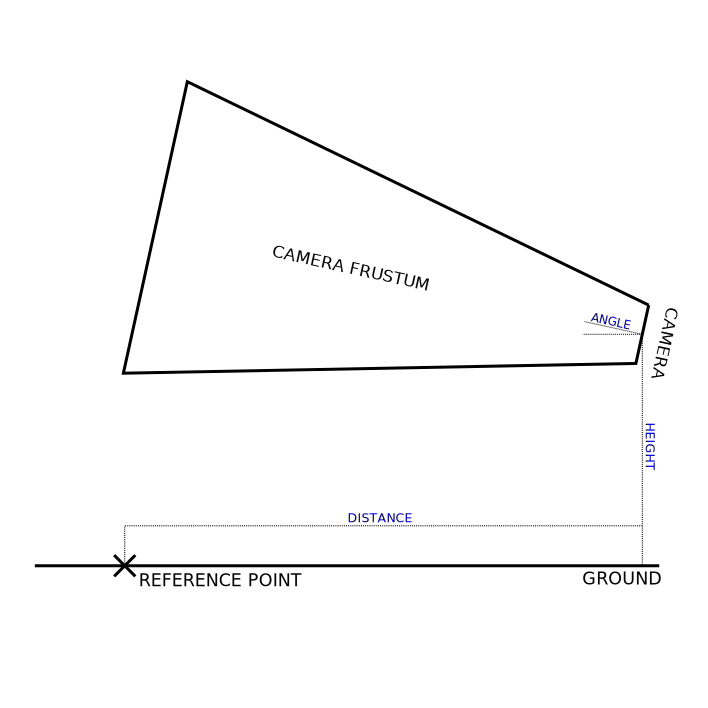

As it turns out, the values in my setup are:

    Z3C distance: 225cm
    Z3C height: 119cm
    Z3C angle: 5 degrees
    LG distance: 390cm
    LG height: 94cm
    LG angle: 5 degrees

### Step 2: Set up the virtual scene

Now we need to **make the tracking setup again, but within Blender**. It's very convenient here if you configure Blender to use real-world units:

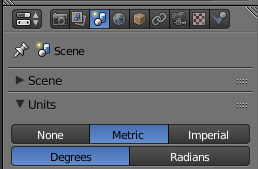

Let's add some Blender cameras with settings that match our real cameras:

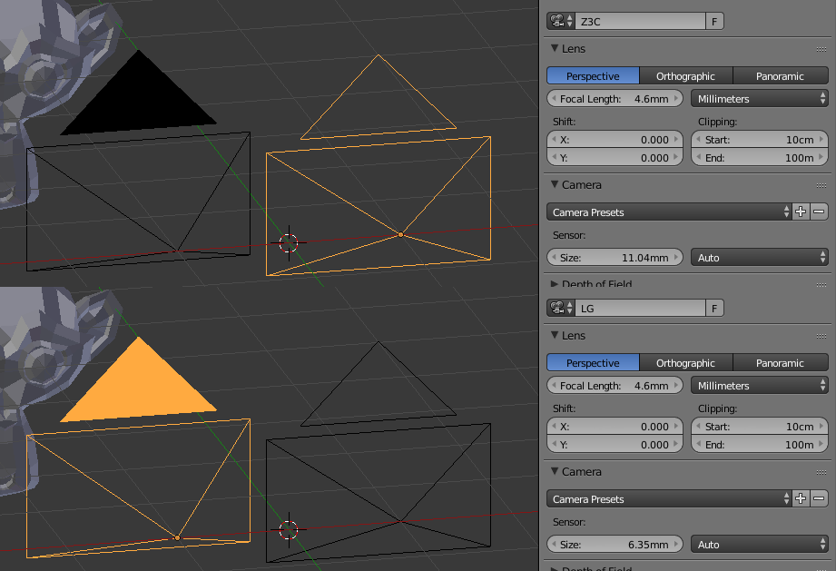

Now, we can position them according to the measurements we made earlier. For example, the virtual LG camera is positioned 390cm away from the origin along the X axis, and 95cm above:

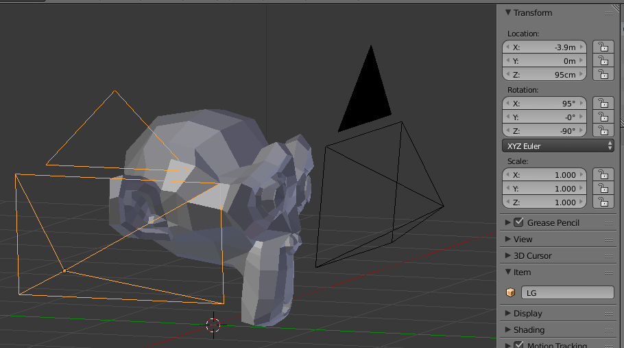

The Suzanne model in the center is used to show where our final result will be - where the tracking results will show up.

The intended use case for this addon is for animators who have a dedicated tracking setup to be able to start tracking anytime without the need for calibration or tweaking.

I made a sword prop from a Nerf sword, a bunch of LEDs, some resistors, wire, and a phone power bank. Each LED has a distinct color so that they're easy to tell apart in the dark:

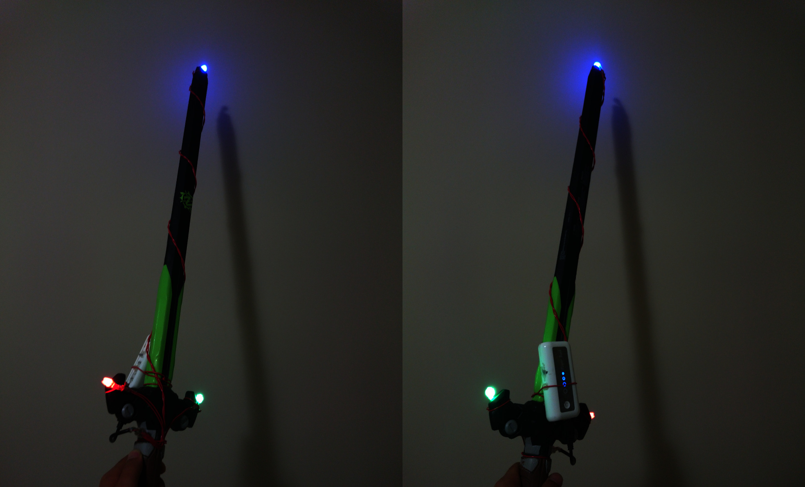

### Step 3: Record some video

We **start recording with both cameras** (timing is not particularly important here), wave the prop around a bit, and then stop them again. Here's a still frame from the Z3C's captured video:

You'll notice that the room is quite dark, in order to get better contrast with the LEDs against the background. This makes it a lot easier to track them later. In my setup, the room is actually not that dark, but the contrast is increased and the brightness decreased using Avidemux.

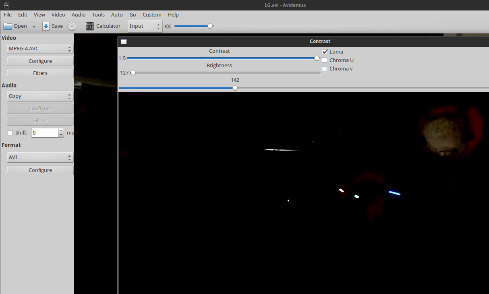

To help synchronize the videos later, **do a quick clap at the beginning or end of recording**. Later on, we will match the videos up using this clap as a reference point. See the last section if you want to download these videos to play around with.

### Step 4: Import and track videos

Back to Blender now - we're going to import the two videos into the movie clip editor.

Now we want to **synchronize the videos so when they're played at the same time**, the sword waving happens at the same frames in both videos. Do this by changing the Frame Offset of the clip settings until the clap from step 3 matches up in both videos:

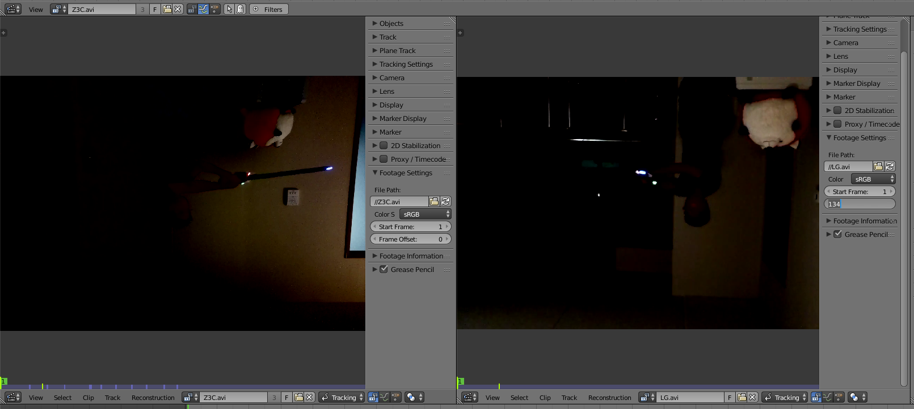

Here, the video from the LG camera had 134 more frames in the beginning than the Z3C camera, so we're going to set that as the offset so both videos match up. Additionally, the first 4 frames on the Z3C video were corrupted by Avidemux, so we excluded that by adding 4 to both offsets.

Now we'll point track the LEDs in both videos:

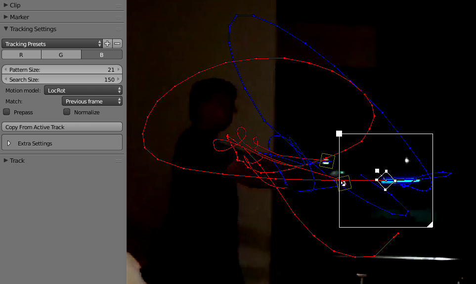

Notice the tracking settings - we're using a big search size since the LEDs move fast, LocRot for the motion model since the light trails both move and rotate, and match against the previous frame since the trails will slowly change shape over time. We don't need to do prepass or normalize since we already processed the video.

Also note that the track for the blue LED is set to only use the blue channel ("B" is selected under tracking settings). This is optional, but improves tracking quality for tracking the blue LED. Likewise, the marker for the red LED only operates on the red channel, and the green one on the green channel.

For each LED, make sure to **name tracks for each LED the same thing in both videos** - the Resolve Camera Tracks addon will match tracks together by name. For example, the tracks for the blue LED are named Blue in both the Z3C video and the LG video:

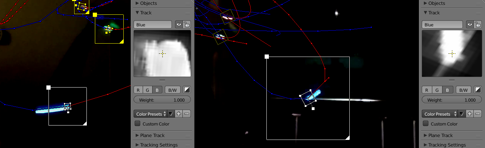

The whole tracking process took a while, since some markers became occluded and needed manual tracking, and motion blur made light trails out of all the LEDs. Occlusion is a problem because reconstruction of an LED's point will only work **as long as at least two cameras track that LED at any given time**. Since we only have two cameras in this demo, I manually tracked all the parts where the LEDs weren't visible to both cameras. In your own setup, you can avoid this simply by adding more cameras - 3 cameras can provide 360 degree coverage for convex shapes. When a marker isn't visible in a frame, just leave it disabled, as long as at least two other cameras can see it.

Motion blur is a problem because light trails are rather hard for the Blender motion tracker to handle - it loses the trail quite often (especially when the light trail changes direction), and the occasionally tracks need to be corrected. Again, I solved this by just moving markers back when they drifted off course, or resetting them when they lost the tracking pattern. In your own setup, you can reduce motion blur by using a higher shutter speed/shorter exposure time, or simply moving slower and then speeding up the animation afterward.

### Step 5: Reconstruct the scene

For each Blender camera, we're going to select all the marker tracks, then generate empties for them. Make sure to make the camera corresponding to the video is set as the default scene camera when doing so (the Z3C Blender camera should be default when generating empties for Z3C.avi, and so on):

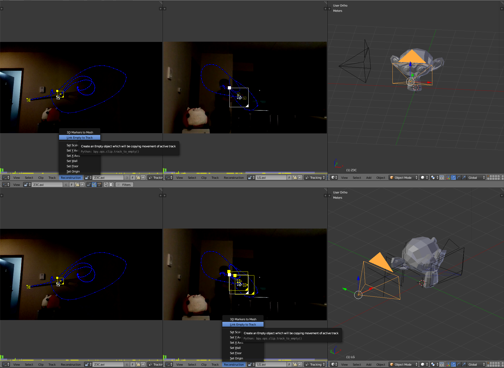

Deleting the Suzanne, we now have a big mess of empties:

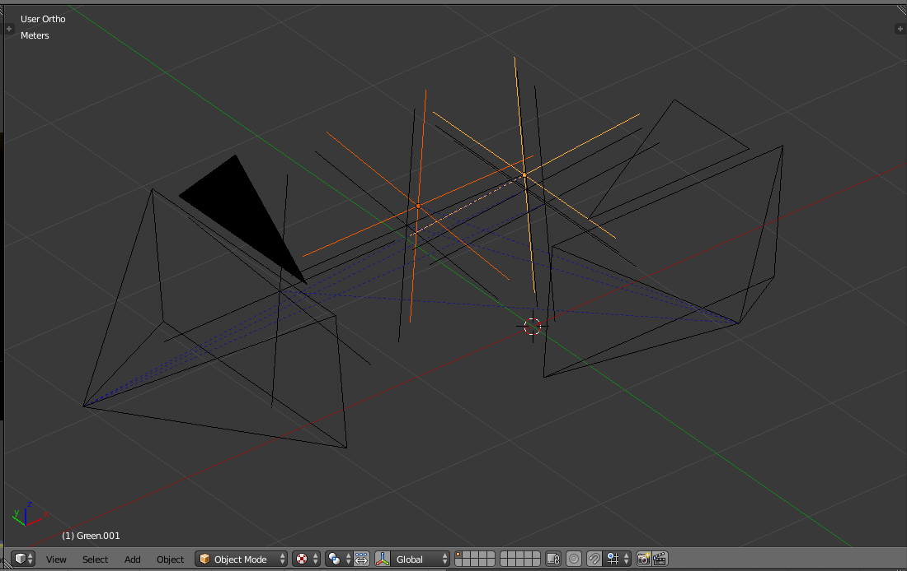

Let's install the Resolve Camera Tracks addon:

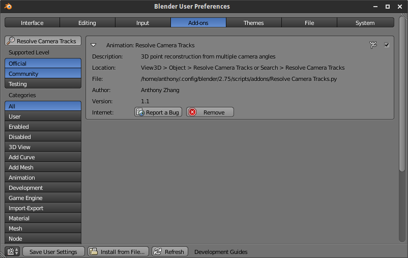

Select all the generated empties, then invoke the tool:

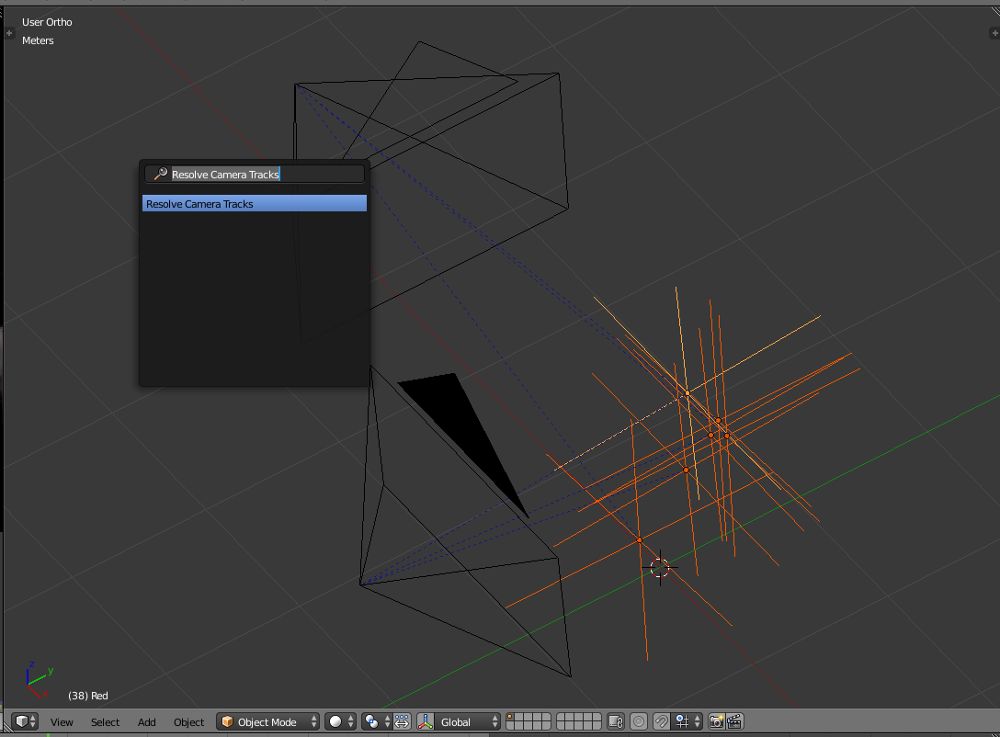

You should get a result like the following (if not, check out the "After" section of the addon README for troubleshooting steps):

Those round empties are the reconstructed points, and are keyframed in world space to follow the motion tracked empties:

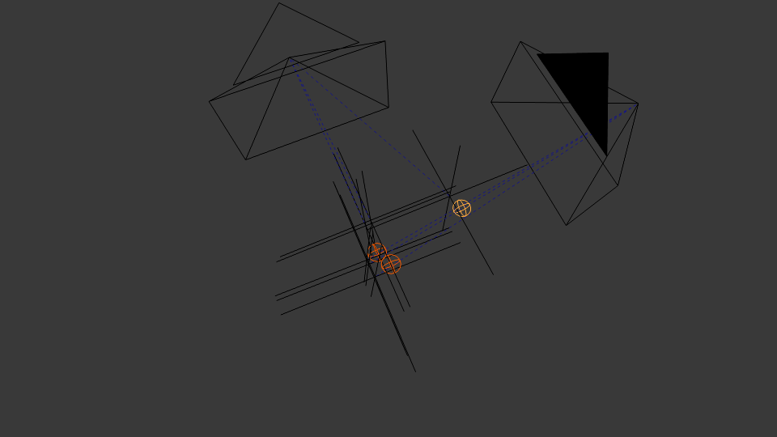

### Step 6: Integrate it into your animation

All this is nice and all, but it's all for nothing if we can't use that animation for anything.

I downloaded a public domain model for [Sting](http://lotr.wikia.com/wiki/Sting) from [BlendSwap](http://www.blendswap.com/blends/view/67037) (credits to **for\_the\_kingdom**!), imported it into the scene, and whipped up a quick rig to make it follow our tracked empties:

The rig is simply a single bone, parented to the red empty, with an inverse kinematics constraint targeting the Blue empty. The pole target is set to the green empty to control bone roll.

Now, a quick HDR environment map, add a camera path, animate the camera with a Follow Track constraint, and we're ready to render!

### Files and stuff

The video and Blender files can be downloaded below. The videos aren't of very good quality though, since they're just cellphone cameras - you would probably be better off recording your own:

* [Video from Z3C (Z3C.avi)](Z3C.avi)
* [Video from LG (LG.avi)](LG.avi)
* [Blend file with all the above steps applied (Scene.blend)](Scene.blend)
