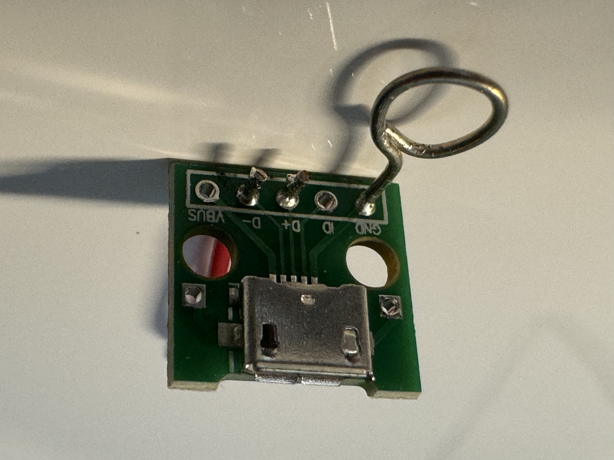
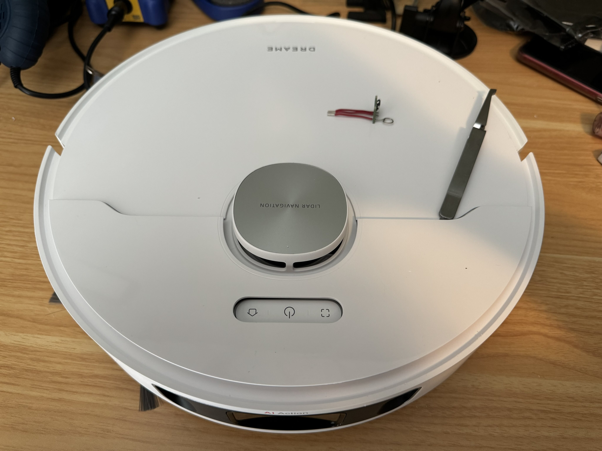
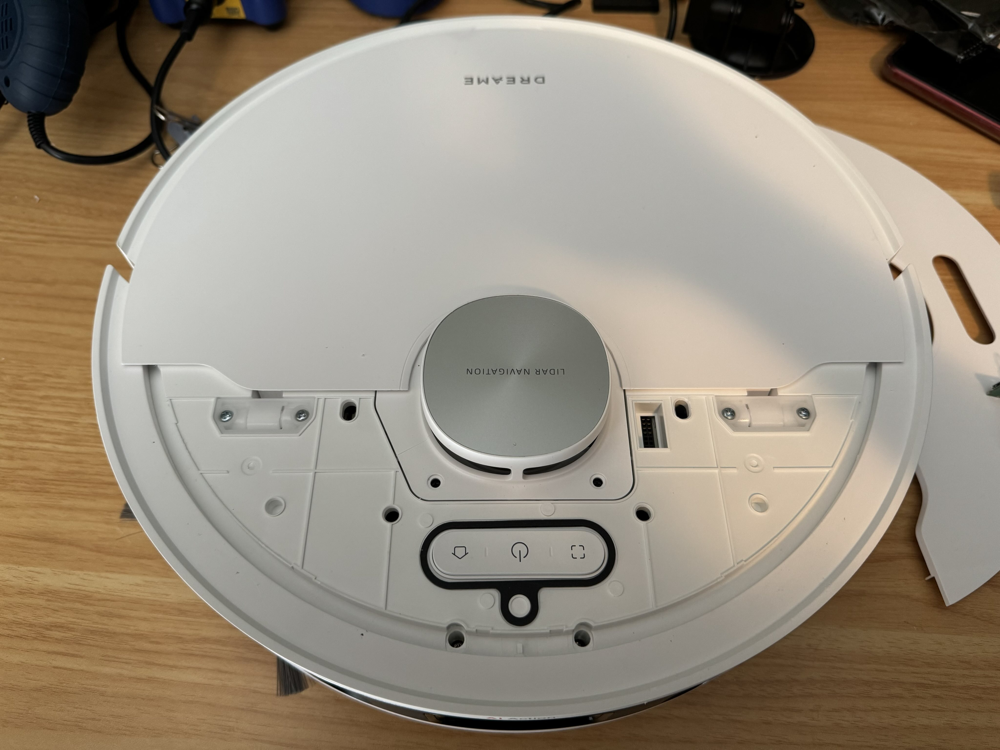
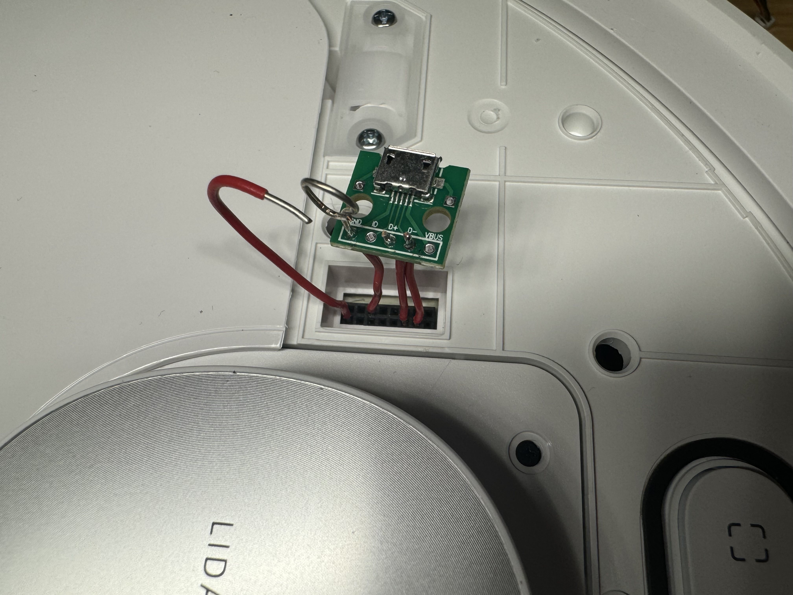

Rationale
---------

I wanted a completely cloud-free robot vacuum capable of both vacuuming and mopping, so I purchased a [Dreame L10S Ultra](https://www.dreametech.com/products/dreamebot-l10s-ultra) when it went on sale a few months ago. Beyond installing [Valetudo](https://valetudo.cloud/) on the robot, this post also covers:

* A simpler but hackier way to access the robot's debug port for initial flashing.
* A custom web UI I made, called [Dreame Maploader Web UI](https://github.com/Uberi/dreame-maploader-web-ui), that wraps Valetudo's web interface and adds the ability to save/load maps and remotely drive the robot.
    * Map saving/loading is a feature that's [explicitly not supported by Valetudo](https://valetudo.cloud/pages/general/why-not-valetudo.html#no-multi-floormulti-map-support). A fork called [Valetudo RE](https://github.com/rand256/valetudo) adds this functionality, but only for Roborock robots, not Dreame ones.
    * Someone else made [Dreame Vacuum Robot Maploader](https://github.com/pkoehlers/maploader), which allows map changes on Dreame robots via MQTT, and the web UI's functionality is based on this repo.
    * Note that the map loading feature is very hacky (it simply swaps out the entire map data folder and restarts Valetudo) - one of the reasons why it wasn't supported by Valetudo to begin with. But it's quite usable in practice, just takes an extra minute to set up.
* Remote access via Tailscale running on-device.
* Basic security hardening. A Valetudo install by default is already much more secure than a cloud-connected robot, but basic :
    * By default, a Valetudo install listens on port 80 for the web UI, port 5353 for mDNS, port 1900 for SSDP, and a few others. This represents a significant attack surface, so we'll add a firewall in front.
    * By default, a Valetudo install allows password SSH authentication. This is less secure than using publickey auth, so we'll disable password authentication entirely.
    * The Valetudo web UI is also only accessible via Tailscale (and access-controlled via Tailscale ACLs), rather than anyone on the LAN.
* Realtime browser-based video streaming from the robot's front-facing camera via vacuumstreamer and go2rtc.


Setup Instructions
------------------

1. Install and configure Valetudo:
    1. Make a quick-and-dirty breakout by soldering wires to the `GND`, `D-`, and `D+` pins of a [female USB 2.0 micro-A breakout board](https://www.amazon.ca/DAOKAI-Female-Adapter-Converter-Breakout/dp/B09WQTR1H3/). 
        * You could instead make a [Valetudo Dreame adapter PCB](https://github.com/Hypfer/valetudo-dreameadapter), but this would take longer and likely cost more.
        * Make sure to use AWG22-AWG26 wire, or else the wires will be too large or too small to fit into the robot's debug port.

        

    2. Pry off the front top cover of the robot, exposing the debug port on the right of the round LIDAR module in the middle. Two flathead screwdrivers or small chisels are useful for this, since there are quite a few places to apply force.
        
        
        

    3. Follow the [official Valetudo fastboot rooting instructions](https://valetudo.cloud/pages/installation/dreame.html#fastboot), but with the following changes:
        * Wherever it talks about plugging the breakout PCB into the robot, instead connect the board as shown below, with the lone wire on the BOOT_SEL pin bent to be near the wire loop on the GND pin - this forms a makeshift button that you can activate by squeezing the BOOT_SEL wire together with the GND wire loop using your fingers.
        * Wherever it talks about pressing the button on the breakout PCB, instead press the BOOT_SEL wire together with the GND wire loop. So to enter fastboot, you would squeeze the two wires together, hold down the power button, wait 5 seconds, release the power button, wait 3 seconds, and release the two wires so that they spring apart.
        * A fresh Debian Bookworm install is not fully required to use `valetudo-sunxi-livesuit`, but if you use, e.g., Ubuntu, then you may have to modify some commands yourself to install it correctly.
        * The `valetudo-helper-httpbridge` method of installing Valetudo and backing up the robot's files didn't work for me, so instead I just used `scp` to transfer the files back and forth.

        

    4. Change the `"blockExternalAccess"` setting (under `"webserver"`) to `false` in `/data/valetudo_config.json`.
        * This allows traffic from Tailscale to talk to the Valetudo web UI. While this does make the Valetudo web UI accessible to traffic from outside the local network as well, we will be setting up firewall rules that will block this in an upcoming step.
    5. Change the `"port"` setting (under `"webserver"`) to `3000` in `/data/valetudo_config.json`.
        * Serving the web UI on port 3000 frees up port 80, which Valetudo would otherwise use by default, for Dreame Maploader Web UI, which we will be setting up in an upcoming step.
2. Install [vacuumstreamer](https://github.com/tihmstar/vacuumstreamer) and [go2rtc](https://github.com/AlexxIT/go2rtc) to stream video to a web UI:
    1. Download vacuumstreamer on the laptop from https://github.com/tihmstar/vacuumstreamer/archive/b1d463ccae60b5bd262f9b0db6639bceae40820c.zip and extract it to the working directory.
    2. Download go2rtc on the laptop from https://github.com/AlexxIT/go2rtc/releases/download/v1.9.4/go2rtc_linux_arm64 to the working directory.
    3. Transfer over the vacuumstreamer and go2rtc binaries and config files on the laptop (replace `192.168.8.101` with the actual IP of the robot, which you can find on your router's management page):

           scp -i ~/.ssh/id_rsa_valetudo go2rtc_linux_arm64 root@192.168.8.101:/data/vacuumstreamer/go2rtc
           cd vacuumstreamer-b1d463ccae60b5bd262f9b0db6639bceae40820c
           ssh -i ~/.ssh/id_rsa_valetudo root@192.168.8.101 "mkdir -p /data/vacuumstreamer"
           scp -i ~/.ssh/id_rsa_valetudo vacuumstreamer.so root@192.168.8.101:/data/vacuumstreamer/vacuumstreamer.so
           scp -i ~/.ssh/id_rsa_valetudo dist/usr/bin/video_monitor root@192.168.8.101:/data/vacuumstreamer/video_monitor
           scp -i ~/.ssh/id_rsa_valetudo -r dist/ava/conf/video_monitor/ root@192.168.8.101:/data/vacuumstreamer/ava_conf_video_monitor

    4. Install and set up vacuumstreamer and go2rtc on the robot over SSH:

           cp -r /mnt/private /data/vacuumstreamer/mnt_private_copy && touch /data/vacuumstreamer/mnt_private_copy/certificate.bin  # workaround for missing certificate bug, see https://github.com/tihmstar/vacuumstreamer/issues/1 for details
           chmod +x /data/vacuumstreamer/go2rtc
           cat <<EOF >> /data/_root_postboot.sh

           if [[ -f /data/vacuumstreamer/video_monitor ]]; then
               mount --bind /data/vacuumstreamer/ava_conf_video_monitor /ava/conf/video_monitor
               mount --bind /data/vacuumstreamer/mnt_private_copy /mnt/private
               LD_PRELOAD=/data/vacuumstreamer/vacuumstreamer.so /data/vacuumstreamer/video_monitor > /dev/null 2>&1 &
               /data/vacuumstreamer/go2rtc -c '{"streams": {"tcp_magic": "tcp://127.0.0.1:6969"}}' > /dev/null 2>&1 &
           fi
           EOF

    3. The video feed can now be viewed from the go2rtc web UI at `http://192.168.8.101:1984` (replace `192.168.8.101` with the actual IP of the robot, which you can find on your router's management page). The video feed is also integrated into the Dreame Maploader Web UI, if you prefer to have everything in one place.
3. Install [Dreame Maploader Web UI](https://github.com/Uberi/dreame-maploader-web-ui) to act as the main web UI:
    1. Download Dream Maploader Web UI on the laptop from https://github.com/Uberi/dreame-maploader-web-ui/archive/refs/heads/main.zip and extract it to the working directory.
    2. Transfer over the Dreame Maploader Web UI binary and resource files on the laptop (replace `192.168.8.101` with the actual IP of the robot, which you can find on your router's management page):

           scp -i ~/.ssh/id_rsa_valetudo dreame-maploader-web-ui root@192.168.8.101:/data/dreame-maploader-web-ui
           scp -i ~/.ssh/id_rsa_valetudo map-loaded.wav root@192.168.8.101:/data/map-loaded.wav

    3. Install and set up the Dreame Maploader Web UI daemon on the robot over SSH:

           cat <<EOF >> /data/_root_postboot.sh

           if [[ -f /data/dreame-maploader-web-ui ]]; then
               /data/dreame-maploader-web-ui --robot="Dreame L10S Ultra" --port=80 --save_path=/data/saved_maps --valetudo_port=3000 > /dev/null 2>&1 &
           fi
           EOF
           reboot

4. Set up Tailscale, based on [this Tailscale official blog post](https://tailscale.dev/blog/tailscale-sucks) (instructions modified due to being slightly outdated):
    1. Transfer over the Tailscale binary on the laptop (this binary is downloaded from https://pkgs.tailscale.com/stable/#static) (replace `192.168.8.101` with the actual IP of the robot, which you can find on your router's management page):

           scp -i ~/.ssh/id_rsa_valetudo -r tailscale_1.70.0_arm64 root@192.168.8.101:/data/tailscale

    2. Install and set up the Tailscale daemon on the robot over SSH:

           cat <<EOF >> /data/_root_postboot.sh

           if [[ -f /data/tailscale/tailscaled ]]; then
               mkdir -p /data/tailscale/state /tmp/tailscale
               STATE_DIRECTORY=/tmp/tailscale /data/tailscale/tailscaled --socket=/tmp/tailscale/tailscaled.sock --statedir=/data/tailscale/state > /dev/null 2>&1 &
           fi
           EOF
           reboot

    3. Configure and start Tailscale on the robot over SSH (there will be some manual setup upon running the last command). We configure Tailscale with the netfilter `nodivert` mode to avoid the default Tailscale behavior of bypassing the firewall - we'll handle the firewall setup ourselves in an upcoming step:

           /data/tailscale/tailscale --socket=/tmp/tailscale/tailscaled.sock up --hostname=valetudo --netfilter-mode=nodivert

5. Lock down network access with a firewall, by adding the below to the top of `/data/_root_postboot.sh` on the robot over SSH:

       iptables -A INPUT -i tailscale0 -p tcp --dport 3000 -j ACCEPT  # allow Valetudo web UI access from Tailscale
       iptables -A INPUT -i tailscale0 -p tcp --dport 80 -j ACCEPT  # allow Dreame Maploader Web UI access from Tailscale
       iptables -A INPUT -i tailscale0 -p tcp --dport 8555 -j ACCEPT  # allow WebRTC TCP video streaming from Tailscale
       iptables -A INPUT -i tailscale0 -p udp --dport 8555 -j ACCEPT  # allow WebRTC UDP video streaming from Tailscale
       iptables -A INPUT -i tailscale0 -p tcp --dport 1984 -j ACCEPT  # allow go2rtc web UI access from Tailscale
       iptables -A INPUT -p tcp --dport 22 -j ACCEPT  # allow SSH traffic from anywhere
       iptables -A INPUT -m state --state ESTABLISHED,RELATED -j ACCEPT  # allow communications from hosts we've recently talked to (used for TCP connections and DNS responses)
       iptables -A INPUT -p udp --dport 5353 -j ACCEPT  # allow mDNS traffic from anywhere
       iptables -A INPUT -p udp --dport 41461 -j ACCEPT  # allow Tailscale connection traffic from anywhere (optional, but makes it easier to create a direct connection on difficult networks rather than going through a relay, see https://tailscale.com/kb/1082/firewall-ports)
       iptables -A INPUT -i lo -j ACCEPT  # allow all traffic on the loopback interface
       iptables -P INPUT DROP  # deny IPv4 traffic by default

       # normally, we would add equivalent IPv6 rules via ip6tables, but this system doesn't have a working ip6tables, so we'll just disable IPv6 entirely (you can confirm this works by using `ip a` before and after, and noticing that the `inet6` entries are gone afterward)
       echo 1 > /proc/sys/net/ipv6/conf/all/disable_ipv6
       echo 1 > /proc/sys/net/ipv6/conf/default/disable_ipv6

6. Double check that you can SSH into the robot using your public key rather than a password, then disable password SSH login on the robot via SSH:

       touch /mnt/misc/ssh_disable_passwords  # this file is checked by `/etc/rc.d/dropbear.sh` on boot
       reboot  # restart to apply changes

After these steps, the contents of `/data/_root_postboot.sh` should look something like this:

```sh
#!/bin/sh

iptables -A INPUT -i tailscale0 -p tcp --dport 3000 -j ACCEPT  # allow maploader web UI access from Tailscale
iptables -A INPUT -i tailscale0 -p tcp --dport 80 -j ACCEPT  # allow Valetudo web UI access from Tailscale
iptables -A INPUT -i tailscale0 -p tcp --dport 8555 -j ACCEPT  # allow WebRTC TCP video streaming from Tailscale
iptables -A INPUT -i tailscale0 -p udp --dport 8555 -j ACCEPT  # allow WebRTC UDP video streaming from Tailscale
iptables -A INPUT -i tailscale0 -p tcp --dport 1984 -j ACCEPT  # allow go2rtc web UI access from Tailscale
iptables -A INPUT -p tcp --dport 22 -j ACCEPT  # allow SSH traffic from anywhere
iptables -A INPUT -m state --state ESTABLISHED,RELATED -j ACCEPT  # allow communications from hosts we've recently talked to (used for TCP connections and DNS responses)
iptables -A INPUT -p udp --dport 5353 -j ACCEPT  # allow mDNS traffic from anywhere
iptables -A INPUT -p udp --dport 41461 -j ACCEPT  # allow Tailscale connection traffic from anywhere (optional, but makes it easier to create a direct connection on difficult networks rather than going through a relay, see https://tailscale.com/kb/1082/firewall-ports)
iptables -A INPUT -i lo -j ACCEPT  # allow all traffic on the loopback interface
iptables -P INPUT DROP  # deny traffic by default

# normally, we would add equivalent IPv6 rules via ip6tables, but this system doesn't have a working ip6tables, so we'll just disable IPv6 entirely (you can confirm this works by using `ip a` before and after, and noticing that the `inet6` entries are gone afterward)
echo 1 > /proc/sys/net/ipv6/conf/all/disable_ipv6
echo 1 > /proc/sys/net/ipv6/conf/default/disable_ipv6

# Interestingly, the iw command does not always have the same effect as these module parameters
# It is expected that some of these will fail as the robot has only one of those modules
echo 0 > /sys/module/8189fs/parameters/rtw_power_mgnt
echo 0 > /sys/module/8188fu/parameters/rtw_power_mgnt
echo 0 > /sys/module/8723ds/parameters/rtw_power_mgnt

iw dev wlan0 set power_save off

if [ ! "$(readlink /data/config/system/localtime)" -ef "/usr/share/zoneinfo/UTC" ]; then
        rm /data/config/system/localtime
        ln -s /usr/share/zoneinfo/UTC /data/config/system/localtime
fi

if [[ -f /data/valetudo ]]; then
        VALETUDO_CONFIG_PATH=/data/valetudo_config.json /data/valetudo > /dev/null 2>&1 &
fi

if [[ -f /data/vacuumstreamer/video_monitor ]]; then
    mount --bind /data/vacuumstreamer/ava_conf_video_monitor /ava/conf/video_monitor
    mount --bind /data/vacuumstreamer/mnt_private_copy /mnt/private
    LD_PRELOAD=/data/vacuumstreamer/vacuumstreamer.so /data/vacuumstreamer/video_monitor > /dev/null 2>&1 &
    /data/vacuumstreamer/go2rtc -c '{"streams": {"tcp_magic": "tcp://127.0.0.1:6969"}}' > /dev/null 2>&1 &
fi

if [[ -f /data/tailscale/tailscaled ]]; then
        mkdir -p /data/tailscale/state /tmp/tailscale
        STATE_DIRECTORY=/tmp/tailscale /data/tailscale/tailscaled --socket=/tmp/tailscale/tailscaled.sock --statedir=/data/tailscale/state > /dev/null 2>&1 &
fi

if [[ -f /data/dreame-maploader-web-ui ]]; then
    /data/dreame-maploader-web-ui --robot="Dreame L10S Ultra" --port=80 --save_path=/data/saved_maps --valetudo_port=3000 > /dev/null 2>&1 &
fi
```
