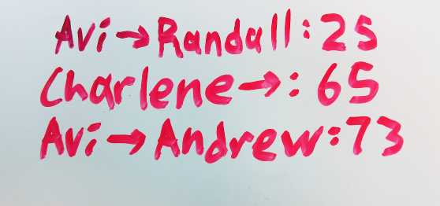
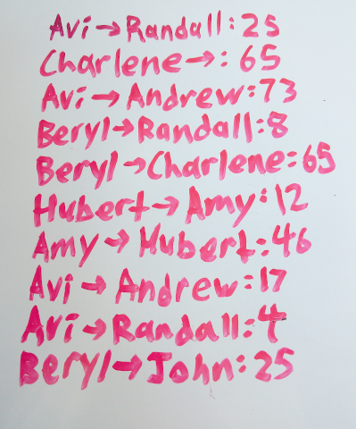
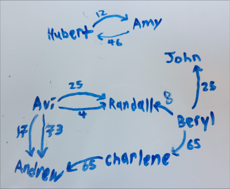

Do you have a whiteboard? Do you share it with a group of people? It probably has some variation of this:

Each line of the form $$X \to Y: a$$ represents a **transaction** - the fact that $$X$$ owes $$Y$$ exactly $$a$$ dollars, where $$X$$ and $$Y$$ are people and $$a$$ is a dollar amount.

Every time a new transaction is created, we can just add a new entry to the list. However, this causes the list to slowly grow out of control:

Our goal is to make this list smaller. Let's kick this off by representing the above example in code. In this post I will be using Python 3:


owings = [
    ("Avi",      "Randall",   25), # Avi owes Randall 25 dollars
    ("Charlene", "Andrew",    65),
    ("Avi",      "Andrew",    73),
    ("Beryl",    "Randall",    8),
    ("Beryl",    "Charlene",  65),
    ("Hubert",   "Amy",       12),
    ("Amy",      "Hubert",    46),
    ("Avi",      "Andrew",    17),
    ("Avi",      "Randall",    4),
    ("Beryl",    "John",      25),
]


This list of transactions is a graph, where people are the vertices, transactions are edges, and dollar values are the edge labels. Edges in this graph are directed since $$X$$ owing $$Y$$ is not the same as $$Y$$ owing $$X$$. I'm going to call this structure an **owing graph**.

The above, then, translates to the following:

Two owing graphs are **equivalent** if when everyone in either graph pays the amounts they owe everyone else, they end up with the same amounts in the end. Our goal is to find the **smallest possible graph (a graph with the fewest possible edges) that is equivalent to a given owing graph**.

### Start your text editors

Solving this problem optimally is NP-complete, since it requires solving the subset-sum problem repeatedly. However, we don't care and just want to generate some minimal transactions, even if it takes exponential time to run. Afterwards, we will look at an approximate, much more efficient solution that works just as well for most inputs.

First, we will calculate the overall amount each person owes - the net balances:


from collections import defaultdict
net_values = defaultdict(int) # net dollar amount each person owes
for entry in owings:
    net_values[entry[0]] += entry[2]
    net_values[entry[1]] -= entry[2]


This algorithm will create a graph using the star topology (all vertices have 1 transaction with a designated **hub vertex**), which, in a set of $$n$$ people, results in exactly $$n - 1$$ transactions taking place - the hub has one transaction with each other person.

Suppose we partition the set of people into $$k$$ disjoint sets of people such that no set owes any other (there are no transactions between any two sets). Then, for each set, we construct a graph with a star topology. The graph for a set of size $$m$$ has $$m - 1$$ transactions, and so $$n - k$$ transactions take place in total (the sum of the sizes of all the subsets in the partition is always the size of the original set). If we maximize $$k$$, then we minimize $$n - k$$, the number of transactions.

Clearly, no two sets will owe any other if and only if the sum of all the net balances in the set is 0. This is because if the sum of the net balances of a set was non-zero, money must be flowing into or out of that set of people.

Therefore, **we want to partition the set of people into the largest possible number of disjoint subsets, such that the sum of each subset is 0**. Afterwards, we simply construct graphs out of each set in the resulting partition, and we will have the smallest possible owing graph.

The partitioning part is actually what makes the problem NP-complete - if we can solve this problem in polynomial time, we can solve the subset-sum problem in polynomial time, and prove that $$P = NP$$. The number of partitions of a set of size $$n$$ is the $$n$$th [Bell numbers](https://en.wikipedia.org/wiki/Bell_number#Set_partitions), and according to that page, there are $$O\left(\left(\frac{0.792n}{\ln(n + 1)}\right)^n\right)$$ (or more loosely, $$O(n^n)$$) possible partitions. We will use a naive approach and simply check if all the subsets of a partition add up to 0.

One way to enumerate all partitions of a set of size $$n$$ is to, for each partition, allocate $$n$$ subsets, go through each element, and assign them to one of those subsets (afterward, we filter out empty subsets from the partition) - there is one unique element assignment per unique partition:


def all_partitionings(elements):
    labels = [0] * len(elements)
    while True:
        # generate the results
        partitions = [set() for _ in elements]
        for element, label in zip(elements, labels): partitions[label].add(element)
        yield [partition for partition in partitions if partition]

        # increment the labels
        labels[-1] += 1
        i = len(labels) - 1
        while labels[i] == len(elements) and i > 0:
            labels[i] = 0
            i -= 1
            labels[i] += 1
        if labels[0] == len(elements): break


This is very simple and works well, but we don't get the partitions in a nice order - ideally, we want to get them in decreasing order by number of subsets, because then we can stop looking through partitions as soon as we find one where all subsets sum to 0.

There is another way to do that, which is almost as simple. We first take one vertex $$v$$ from the set of vertices $$V$$, and compute all the partitions of $$V - v$$. For each partition $$p$$ of $$V - v$$, we can compute one partition of $$V$$ by adding $$v$$ as a subset, and more partitions by adding $$v$$ to each subset of the partition in turn:


def all_partitions(elements, max_index = None): # return partitions from most subsets to least subsets
    if max_index == None: max_index = len(elements) - 1
    if max_index < 0: yield () # zero elements has no partitions in its one partitioning
    else:
        current_subset = (elements[max_index],) # obtain a single element subset of the available elements
        for partition in all_partitions(elements, max_index - 1): # compute the partitions of the set without the current subset
            yield partition + (current_subset,) # insert the current subset as its own subset in the partition
            for i, subset in enumerate(partition): # insert the current subset into each subset in the partition in turn
                yield partition[:i] + (subset + current_subset,) + partition[i + 1:]


Here, we store the set of vertices as a list in order to use indexing. The only unusual thing to note is that we use `max_index` to mark the end of `elements` rather than making copies of `elements`, for efficiency reasons. This generator function yields partitions in order from most subsets to least subsets.

We can now calculate the partition with the most subsets that sums to 0 pretty easily:


def largest_partition(net_balances):
    vertices = list(net_balances.keys())
    for partition in all_partitions(vertices):
        for subset in partition:
            if sum(net_balances[vertex] for vertex in subset) != 0: break
        else: # all subsets sum to 0
            return tuple(set(subset) for subset in partition)
    return None


This is pretty self-explanatory - we go through each partition, from most subsets to least subsets, and if any partition contains only subsets where the elements sum up to 0, we've found the result.

To generate the minimal graphs now, we go through the subsets in our partition - the sets of vertices whose net balances add up to 0. For each set of vertices, we output edges to make a graph with a star topology:


new_owings = [] # list of transactions
for subset in largest_partition(net_balances):
    vertex_hub = subset.pop() # pick arbitrary hub, and remove it from the set of vertices
    new_owings += [
        (
            (vertex_hub, vertex, net_balances[vertex]) # hub owes the person
            if net_balances[vertex] > 0 else
            (vertex, vertex_hub, -net_balances[vertex]) # person owes the hub
        )
        for vertex in subset if net_balances[vertex] != 0
    ]


Here, we pick a hub vertex, and for each of the remaining vertices in the subset, we create a transaction between the hub and that vertex. The resulting edge list represents a minimal owing graph!

Let's test it out with our first example:


from pprint import pprint
pprint(minimize_owings([
    ("Avi",      "Randall",   25), # Avi owes Randall 25 dollars
    ("Charlene", "Andrew",    65),
    ("Avi",      "Andrew",    73),
    ("Beryl",    "Randall",    8),
    ("Beryl",    "Charlene",  65),
    ("Hubert",   "Amy",       12),
    ("Amy",      "Hubert",    46),
    ("Avi",      "Andrew",    17),
    ("Avi",      "Randall",    4),
    ("Beryl",    "John",      25),
]))


The above outputs:


[('Hubert', 'Amy', 34),
 ('John', 'Beryl', 25),
 ('Beryl', 'Avi', 119),
 ('Andrew', 'Beryl', 155),
 ('Randall', 'Beryl', 37)]


Clearly, this is optimal - it is impossible to resolve these debts using 4 or fewer transactions.

### Some say it's still running to this day

What if we have a larger network, say, 100 people all having various transactions with each other? Aside from needing to buy a bigger whiteboard, an $$O(n^n)$$ algorithm isn't really practical when we have more than a dozen or so people - each additional person massively increases the time needed to run the algorithm.

Here, we need to use approximations. Our goal is now to create an owing graph that is equivalent to the original owing graph, with a preference for smaller graphs - we no longer require that the results be optimal, only reasonably close to optimal. In the real world, reasonable people don't borrow tiny amounts of money from every single person they know for every purchase, or specifically try to borrow from people who indirectly owe them.

Here's an approximation that works pretty well on that sort of owing graph: instead of finding the partition with the largest number of subsets, we simply remove vertices that have a 0 net balance, and use the components of the resulting graph as the partition.

First, we compute the net balances for each person, and remove any people who have a net balance of 0 (as well as transactions that involve these people). People with a net balance of 0 neither owe or are owed any money, in the end:


net_balances = defaultdict(int) # net dollar amount each person is owed
for entry in owings:
    net_balances[entry[0]] += entry[2]
    net_balances[entry[1]] -= entry[2]
nonzero_owings = [entry for entry in owings if net_balances[entry[0]] != 0 and net_balances[entry[1]] != 0]
vertices = {vertex for vertex, net_value in net_balances.items() if net_value != 0}


We then identify the components of the graph, using repeated breadth-first traversal:


def largest_partition_most_of_the_time(vertices, nonzero_owings):
    connections = defaultdict(set) # mapping from each person to the set of people that owe or are owed by this person
    for entry in nonzero_owings:
        connections[entry[0]].add(entry[1])
        connections[entry[1]].add(entry[0])

    components = []
    unvisited_vertices = set(vertices) # duplicate the set of vertices, since we will be mutating both separately later
    while unvisited_vertices: # there are still vertices to visit
        # find all connected vertices and group them together into a component
        component, vertices_to_visit = set(), {unvisited_vertices.pop()}
        while vertices_to_visit:
            vertex = vertices_to_visit.pop() # visit the next vertex
            component.add(vertex)
            vertices_to_visit.update(v for v in connections[vertex] if v not in component) # add all the vertices that are connected that we haven't visited yet
        unvisited_vertices -= component
        components.append(component)
    return tuple(components)


Now we treat our components list as a partition, and generate the star-topology graphs like we did earlier:


new_owings = [] # list of transactions
for subset in largest_partition_most_of_the_time(vertices, nonzero_owings):
    vertex_hub = subset.pop() # pick arbitrary hub, and remove it from the set of vertices
    new_owings += [
        (
            (vertex_hub, vertex, net_balances[vertex]) # hub owes the person
            if net_balances[vertex] > 0 else
            (vertex, vertex_hub, -net_balances[vertex]) # person owes the hub
        )
        for vertex in subset if net_balances[vertex] != 0
    ]


Let's try all this out with the same example as before:


from pprint import pprint
pprint(minimize_owings_approximate([
    ("Avi",      "Randall",   25), # Avi owes Randall 25 dollars
    ("Charlene", "Andrew",    65),
    ("Avi",      "Andrew",    73),
    ("Beryl",    "Randall",    8),
    ("Beryl",    "Charlene",  65),
    ("Hubert",   "Amy",       12),
    ("Amy",      "Hubert",    46),
    ("Avi",      "Andrew",    17),
    ("Avi",      "Randall",    4),
    ("Beryl",    "John",      25),
]))


The above outputs:


[('Hubert', 'Amy', 34),
 ('John', 'Beryl', 25),
 ('Beryl', 'Avi', 119),
 ('Andrew', 'Beryl', 155),
 ('Randall', 'Beryl', 37)]


In this case, the result also happens to be optimal. This is also the case for most real-world inputs!

However, the result will not be optimal whenever the largest partition with subsets that all sum to 0 is larger than the number of components in the graph where all vertices with a 0 net balance are removed. Let's try to construct one of these graphs:

On the top left, we have a graph with a single component, where none of the vertices have a net balance of 0 (each vertex is labelled with the amount they are owed). Running the approximation on this graph results in 3 transactions, when the optimal result, shown on the bottom right, has 2.

There are many ways to improve our approximation: for example, we could detect and break cycles in the graph. However, since the problem is NP-complete, our approximations will never be perfect in all cases without also taking just as much time.

### The leftovers

The code in this post can be downloaded directly:

* [Slow exact solver](minimize_owings.py)
* [Fast approximate solver](minimize_owings_approximate.py)
