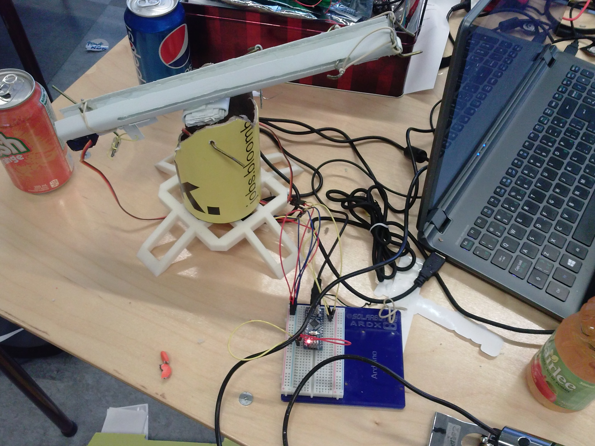
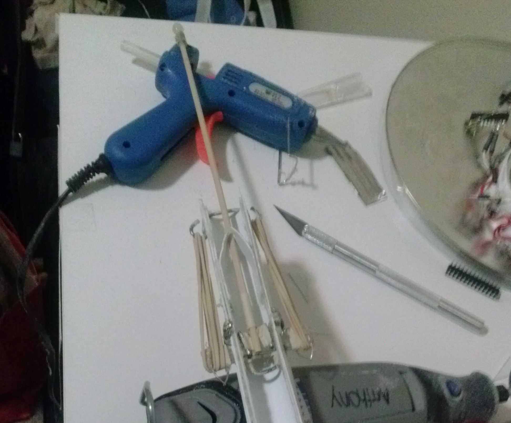
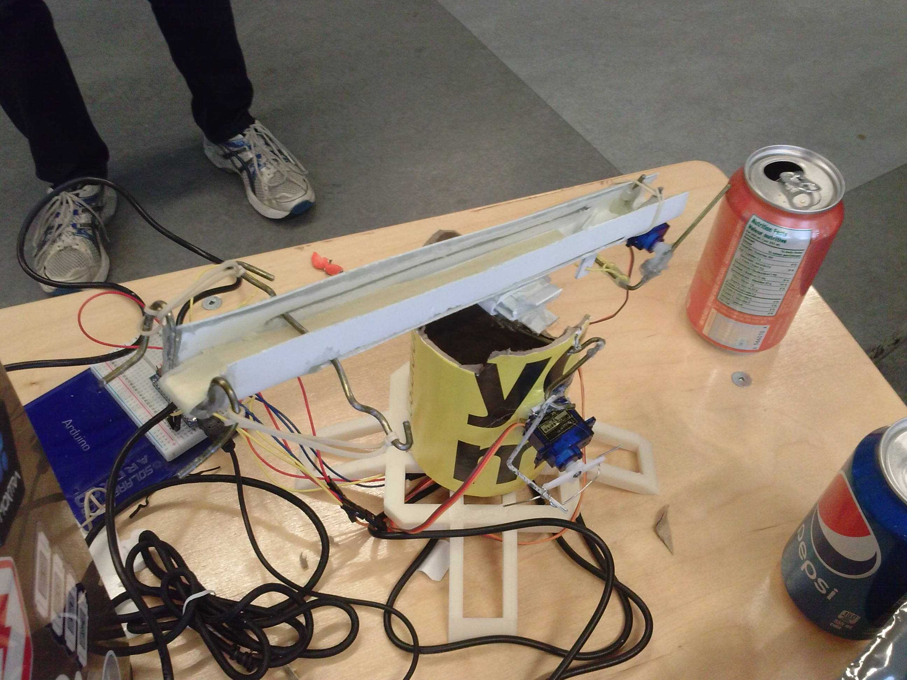
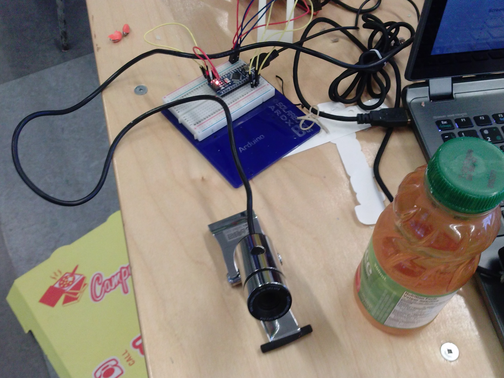

If you emerged unscathed from the torrential stream of Facebook posts a few days ago, last weekend was [Hack the North](http://hackthenorth.com/), an incredible two days of frantic coding, building, and fighting to stay awake. One of the best-organized hackathons I've seen to date!

Anyways, we ended up building [MemoryTime](http://challengepost.com/software/memorytime), as well as [Friendly the Robot](http://challengepost.com/software/friendly-the-robot), which will be the _target_ of this post:

Friendly is a face-tracking, self-aiming bolt-action turret that dispenses candy at people's mouths, using Python, OpenCV, Arduino Nano, and a bunch of micro servos. You can check out the [GitHub repository](https://github.com/Uberi/Turret) if you want to see how we did the tracking part.

The firing assembly itself was quite simple but robust, and looks something like the following (the version depicted below is a newer design):

Probably, the first thing you'll notice is that it's essentially a slingshot - a rigid base piece, a sliding assembly that holds the projectile, and a catchplate at the end that keeps the rubber bands stretched until it's fired. This sort of thing I plan to cover in a later post (edit: [here it is!](../slingshot)), but for now we will treat it as a magical candy firing cylinder controlled by servo.

The turret mechanism itself is a little more interesting. We used an alt-azimuth style mount, which means that there's one degree of freedom for rotating side to side, and one for pointing up and down:

We originally designed a base and a body to be 3D printed in the E5 3D printing labs. However, actually getting it printed was another matter. With only a few hours left, we only had the white plastic base printed - it became necessary to use a yellow packaging tube for t-shirts as our turret body (and it worked!). As we had no proper axles or shaft couplers, the micro servo hot glued to the side of the tube pushes on a piece of coathanger wire, which pushes on the axle coathanger wire to spin the axle. Surprisingly, this actually spins the axle correctly, and the servo horn being shorter than the axle wire provides a mechanical advantage as well.

There's a servo underneath the plastic base, which spins the entire yellow tube and the slingshot on top of it. This was another 180 degree range micro servo, and it wasn't quite as strong as we would've liked. A full-size servo would be a better idea for future projects of this kind. The entire thing, of course, is held together with paperclips and hot glue.

Both servos are controlled with a standard Arduino Nano via the PWM outputs and the [Servo library](https://www.arduino.cc/en/reference/servo). The Arduino itself is running a sketch that looks for serial input and rotates the servos according to the commands received from the laptop it's connected to.

The laptop actually does the heavy lifting. The webcam input is fed into OpenCV to detect faces, ballistic calculations are performed, and serial commands are sent to the Arduino to move the servos to take aim, then fire.

How well did the final design work? Not amazing, but still quite decently. There wasn't enough time for calibrating the movements much, so accuracy left something to be desired. Additionally, the chassis was not as rigid as it could be, considering it was partially cardboard, and so its precision wasn't great. Despite these shortcomings, building this over a sleepless weekend was incredibly fun!
